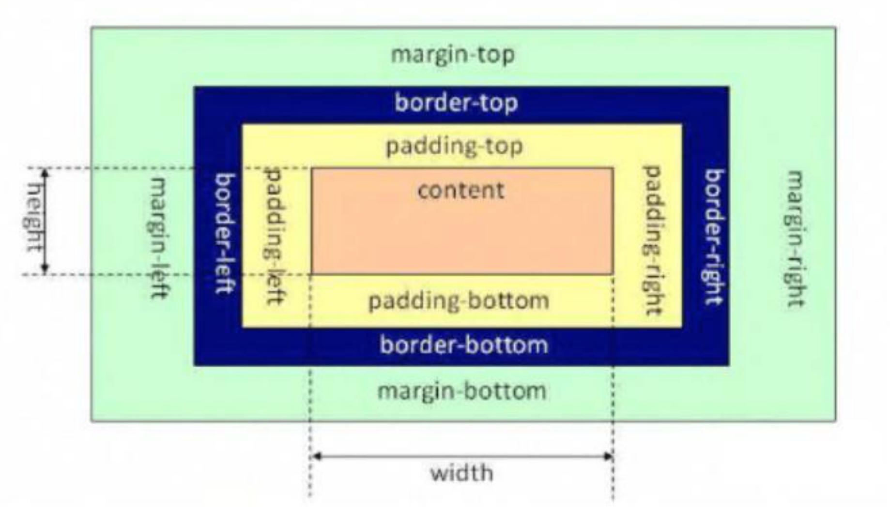

# CSS 面试相关

::: details JavaScript 中获取或者修改 CSS 变量

```js
// 获取一个 Dom 节点上的 CSS 变量
element.style.getPropertyValue("--my-var");

// 获取任意 Dom 节点上的 CSS 变量
getComputedStyle(element).getPropertyValue("--my-var");

// 修改一个 Dom 节点上的 CSS 变量
element.style.setProperty("--my-var", jsVar + 4);
```

:::

::: details [JavaScript 中添加或者移除 CSS 类名](https://developer.mozilla.org/zh-CN/docs/Web/API/Element/classList)

```js
const div = document.createElement("div");
div.className = "foo";

// 初始状态：<div class="foo"></div>
console.log(div.outerHTML);

// 使用 classList API 移除、添加类值
div.classList.remove("foo");
div.classList.add("anotherclass");

// 添加或移除多个类值
div.classList.add("foo", "bar", "baz");
div.classList.remove("foo", "bar", "baz");

// 使用展开语法添加或移除多个类值
const cls = ["foo", "bar"];
div.classList.add(...cls);
div.classList.remove(...cls);

// 如果 visible 类值已存在，则移除它，否则添加它
div.classList.toggle("visible");

// 将类值 "foo" 替换成 "bar"
div.classList.replace("foo", "bar");
```

:::

:::warning attr() 理论上能用于所有的 CSS 属性但目前支持的仅有伪元素的 content 属性，其他的属性和高级特性目前是实验性的

````js
<p data-foo="hello">world</p>
p:before {
    content:attr(data-foo) " ";
}
:::

:::tip  获取伪元素的dom
window.getComputedStyle(ele,null)

这个函数可以获取dom对象的css的显示的属性。函数的第二个参数基本上直接填了null，而这个参数实际上就是解决伪元素的。

window.getComputedStyle(ele,'after');

window.getComputedStyle(ele,'before');

:::

## 1. CSS 选择器的优先级顺序

`内联样式` > `ID选择器` > `类选择器` > `标签选择器`

## 2. 通过 CSS 的哪些方式可以实现隐藏页面上的元素？

| 方式                  | 说明                                                                               |
| --------------------- | ---------------------------------------------------------------------------------- |
| opacity: 0            | 通过将元素的透明度设置为 0，实现看起来隐藏的效果；但是依然会占用空间并可以进行交互 |
| visibility: hidden    | 与透明度为 0 的方案非常类似，会占据空间，但不可以进行交互                          |
| overflow: hidden      | 只会隐藏元素溢出的部分；占据空间且不可交互                                         |
| display: none         | 可以彻底隐藏元素并从文档流中消失，不占据空间也不能交互，且不影响布局               |
| z-index: -9999        | 通过将元素的层级置于最底层，让其他元素覆盖住它，达到看起来隐藏的效果               |
| transform: scale(0,0) | 通过将元素进行缩放，缩小为 0；依然会占据空间，但不可交互                           |
| left: -9999px         | 通过将元素定位到屏幕外面，达到看起来看不到的效果                                   |

## 3. 让元素水平居中的方法有哪些？

**方法一：使用 margin**

通过为元素设置左右的 margin 为 auto，实现让元素居中。

```html
<div class="center">本内容会居中</div>
````

```css
.center {
  height: 500px;
  width: 500px;
  background-color: pink;
  margin: 0 auto;
}
```

**方式二: 转成行内块, 给父盒子设置 text-align: center**

```html
<div class="father">
  <div class="center">我是内容盒子</div>
</div>
```

```css
.father {
  text-align: center;
}
.center {
  width: 400px;
  height: 400px;
  background-color: pink;
  display: inline-block; // 转成行内快
}
```

**方法三：使用 flex 布局**

使用 flex 提供的子元素居中排列功能，对元素进行居中。

```html
<div class="father">
  <div class="center">我是内容盒子</div>
</div>
```

```css
.father {
  display: flex;
  background-color: skyblue;
  justify-content: center;
  align-items: center;
}
.center {
  width: 400px;
  height: 400px;
  background-color: pink;
}
```

**方式四: 使用定位布局**

```html
<div class="father">
  <div class="center">我是内容盒子</div>
</div>
```

```css
.father {
  background-color: skyblue;
  position: relative;
  height: 500px;
}
.center {
  width: 400px;
  height: 400px;
  background-color: pink;
  position: absolute;
  left: 50%;
  top: 50%;
  transform: translate(-50%, -50%);
}
```

[【更多方式参考】实现水平居中垂直居中](https://www.cnblogs.com/chengxs/p/11231906.html)

## 4. CSS 中的定位方式

**static 正常文档流定位**

- 此时设置 top、right、bottom、left 以及 z-index 都无效
- 块级元素遵循从上往下纵向排列，行级元素遵循从左到右排列

**relative 相对定位**

这个 **“相对”** 是指相对于正常文档流的位置。

**absolute 绝对定位**

当前元素相对于 **最近的非 static 定位的祖先元素**来确定自己的偏移位置。

例如，当前为 absolute 的元素的父元素、祖父元素都为 relative，则当前元素会相对于父元素进行偏移定位。

**fixed 固定定位**

当前元素相对于屏幕视口 viewport 来确定自己的位置。并且当屏幕滚动时，当前元素的位置也不会发生改变。

**sticky 粘性定位**

这个定位方式有点像 relative 和 fixed 的结合。当它的父元素在视口区域、并进入 top 值给定的范围内时，当前元素就以 fixed 的方式进行定位，否则就以 relative 的方式进行定位。

## 5. 如何理解 z-index？

可以将它看做三维坐标 系中的 z 轴方向上的图层层叠顺序。

**元素默认的 z-index 为 0，可通过修改 z-index 来控制设置了 postion 值的元素的图层位置**。
可以将这种关系想象成一摞书本，通过 z-index 可以改变一本书在这摞书中的上下位置。

> z-index 的小坑, 如果**父辈元素有定位**, 且配置了 z-index, 优先按照父辈元素的定位的 z-index 进行比较层级

## 7. 谈谈你对 BFC 的理解？

**什么是 BFC：**

BFC 的全称是 Block Formatting Context，块级格式化上下文。这是一个用于在盒模型下布局块级盒子的独立渲染区域，

将处于 BFC 区域内和区域外的元素进行**互相隔离**。

**何时会形成 BFC：**

满足下列条件之一就可触发 BFC：

- HTML 根元素
- position 值为 `absolute` 或 `fixed`
- float 值不为 `none`
- overflow 值不为 `visible`
- display 值为 `inline-block`、`table-cell` 或 `table-caption`

**BFC 的应用场景：**

1. 场景一：防止两个相邻块级元素的上下 margin 发生重叠 (**上下 margin 合并问题**)

属于同一 BFC 的, 两个相邻块级子元素的上下 margin 会重叠，如果想让它们不重叠，可通过让这两个相邻块级子元素分属于不同的 BFC。

2. 场景二：**清除浮动**

以下示例代码中， 容器元素 box1 的高度会没有高：

```html
<style>
  .box1 {
    width: 200px;
    background-color: red;
  }

  .box2 {
    float: left;
    background-color: green;
  }
</style>

<div class="box1">
  <div class="box2">Hello,world</div>
  <div class="box2">Hello,world</div>
  <div class="box2">Hello,world</div>
</div>
```

而通过为 box1 添加 BFC 触发条件，可以让它的高度变回正常状态：

```css
.box1 {
  width: 200px;
  background-color: red;
  overflow: hidden; /** overflow部位visible 触发BFC */
}
```

3. 场景三：**实现自适应布局**, 防止元素被浮动元素覆盖(左边固定, 右边自适应)

以下示例中，box2 会被设置了浮动的 box1 覆盖：

```html
<style>
  .box1 {
    float: left;
    width: 300px;
    background-color: red;
    height: 400px;
  }

  .box2 {
    background-color: blue;
    height: 600px;
  }
</style>

<div class="box1"></div>
<div class="box2"></div>
```

要避免这种覆盖行为，可以让 box2 触发 BFC, 实现布局效果, 左边固定右边自适应：

```css
.box2 {
background-color: blue;
height: 600px;
overflow: hidden; /_ 将 overflow 设置为非 visible 值可触发 BFC _/
}
```

## 8. 你对盒子模型的理解是什么样的？

浏览器的渲染引擎在对网页文档进行布局时，会按照 “CSS 基础盒模型” （CSS Basic Box Model）标准，将文档中的所有元素都表示为一个个矩形的盒子，再用 CSS 去决定这些盒子的大小尺寸、显示位置、以及其他属性（如颜色、背景、边框等）。

下图就是盒模型示意图，它由几部分组成：

- 内容（content）
- 内边距（padding）
- 边框（border）
- 外边距（margin）

## 9. 标准盒模型和怪异盒模型有哪些区别？

两者的区别主要体现在元素尺寸的表示上。

**盒模型的指定：**

在 CSS3 中，我们可以通过设置 box-sizing 的值来决定具体使用何种盒模型：

- content-box 标准盒模型
- border-box 怪异盒模型

**标准盒模型：**

box-sizing: content-box; (默认值)

在标准盒模型下，元素的宽（width）和高（height）值即为盒模型中内容（content）的实际宽高值。

因此，计算一个元素宽度的公式如下(不考虑 margin, margin 是外边距, 如果是计算占用页面的空间, 就要带上 margin)：

> 盒子宽度 = `border-left` + `padding-left` + `width` + `padding-right` + `border-right`
>
> 占据页面宽度 = `margin-left` + `border-left` + `padding-left` + `width` + `padding-right` + `border-right` + `margin-right`

**怪异盒模型：**

box-sizing: border-box; (目前主流常用值)

在怪异盒模型下，元素的 width 和 height 值却不是 content 的实际宽高，而是去除 margin 后剩下的元素占用区域的宽高，即：

因此，计算一个元素占用了页面总宽度的公式如下：

> 盒子宽度 = `width`
>
> 盒子占据页面宽度 = `margin-left` + `width` + `margin-right`

[参考文章：深入理解盒模型](https://www.cnblogs.com/xiaohuochai/p/5202597.html)

## 10. 说说伪类和伪元素的区别？

**什么是伪类？**

伪类（pseudo-class）是以冒号`:`为前缀，可被添加到⼀个选择器的末尾的关键字。

它用于让样式在元素的特定状态下才被应用到实际的元素上。比如：`:checked`、`:hover`、`:disabled`、 `:first-child`等。

:hover

:nth-child(1)

:nth-child(2)

:checked

注意: 伪类, 虽然是写法比较特殊, css 选择器的权重, 和类一致的

**什么是伪元素？**

:before / :after

伪元素⽤于创建⼀些并不在 DOM 树中的元素，并为其添加样式。伪元素的语法和伪类类似，可以一个冒号或两个冒号为前缀。

⽐如，可以通过 `:before` 、`:after` 来在⼀个元素前、后增加⼀些额外的⽂本并为它们添加样式；

并且，虽然⽤户可以看到这些⽂本，但其实它们并不在 DOM 树中。(**坑: 伪元素是无法注册事件的, 所以不要通过 js 控制伪元素**)

**两者的区别**

虽然它们在语法上是一致的，但是它们的功能区别还是非常明显的。

- 伪类是用来匹配元素的特殊状态的
- 伪元素是用来匹配元素的隶属元素的，这些隶属元素可以在界面中展示，但在 DOM 中不体现

[参考文章：伪类与伪元素](http://www.alloyteam.com/2016/05/summary-of-pseudo-classes-and-pseudo-elements/)

## 11. 谈谈你对 flex 的理解？

flex 弹性盒模型的优势在于开发⼈员只需要声明布局应该具有的⾏为，⽽不需要给出具体的实现⽅式，浏览器负责完成实际布局，当布局涉及到不定宽度，分布对⻬的场景时，就要优先考虑弹性盒布局。

**order 属性**：定义项目的排列顺序。**数值越小，排列越靠前，默认为 0**。

**flex-grow 属性**：定义项目的**放大比例，默认为 0**，即如果存在剩余空间，也不放大。

```txt
如果所有项目的 flex-grow 属性都为 1，则它们将等分剩余空间（如果有的话）。
如果一个项目的 flex-grow 属性为 2，其他项目都为1，则前者占据的剩余空间将比其他项多一倍。
```

**flex-shrink 属性**：定义了项目的**缩小比例，默认为 1**，即如果空间不足，该项目将缩小。（负值对该属性无效。）

```txt
如果所有项目的 flex-shrink 属性都为 1，当空间不足时，都将等比例缩小。
如果一个项目的 flex-shrink 属性为 0，其他项目都为 1，则空间不足时，前者不缩小。
```

**flex-basis 属性**: **默认值为 auto，即项目的本来大小。**

```txt
flex-basis 属性定义了在分配多余空间之前，项目占据的主轴空间（main size）,
它可以设为跟 width 或 height 属性一样的值（比如 350px），则项目将占据固定空间。
```

**flex 属性**: `flex`属性是`flex-grow`, `flex-shrink` 和 `flex-basis`的简写，默认值为`0 1 auto`。后两个属性可选。

```txt{2}
该属性有两个快捷值：auto (1 1 auto) 和 none (0 0 auto)。
建议优先使用这个属性，而不是单独写三个分离的属性，因为浏览器会推算相关值。
```

**flex-direction**: **调整主轴方向**

```txt
row：主轴方向为水平向右
column：主轴方向为竖直向下
row-reverse:主轴方向为水平向左
column-reverse:主轴方向是竖直向上。
```

**justify-content**: 主要用来设置**主轴方向的对齐方式**

```
flex-start: 弹性盒子元素将向起始位置对齐
flex-end: 弹性盒子元素将向结束位置对齐。
center: 弹性盒子元素将向行中间位置对齐
space-around: 弹性盒子元素会平均地分布在行里
space-between:第一个贴左边，最后一个贴右边，其他盒子均分，保证每个盒子之间的空隙是相等的。
space-evenly: 均匀排列每个元素,每个元素之间的间隔相等
```

**align-items**: 用于调整**侧轴的对齐方式**

```txt
flex-start： 元素在侧轴的起始位置对齐。
flex-end： 元素在侧轴的结束位置对齐。
center： 元素在侧轴上居中对齐。
stretch： 元素的高度会被拉伸到最大（不给高度时, 才拉伸）。
```

**align-self 属性**: 可以改变单个项目与`align-items`设置的不一样的对齐方式，**默认值为 auto**

```txt
align-self 属性允许单个项目有与其他项目不一样的对齐方式，可覆盖 align-items 属性。
默认值为 auto，表示继承父元素的 align-items 属性，如果没有父元素，则等同于 stretch。
```

**flex-wrap 属性控制**: flex 容器是单行或者多行,默认不换行

```txt
nowrap： 不换行（默认），如果宽度溢出，会压缩子盒子的宽度。
wrap： 当宽度不够的时候，会换行。
```

**align-content**: 用来设置多行的 flex 容器的排列方式

```txt
flex-start： 各行向侧轴的起始位置堆叠。
flex-end： 各行向弹性盒容器的结束位置堆叠。
center： 各行向弹性盒容器的中间位置堆叠。
space-around： 各行在侧轴中平均分布。
space-between： 第一行贴上边，最后一个行贴下边,其他行在弹性盒容器中平均分布。
stretch：拉伸，不设置高度的情况下。
```

> 可参考 [flex 布局教程](http://www.ruanyifeng.com/blog/2015/07/flex-grammar.html)

## 12. 你对媒体查询的理解是什么样的？

**考察点: 响应式适配**, 根据不同的屏幕尺寸, 显示不同的效果 (设置盒子的样式)

媒体查询是自 CSS3 开始加入的一个功能。它可以进行响应式适配展示。

媒体查询由两部分组成：

- 一个可选的媒体类型（如 screen、print 等）
- 零个或多个媒体功能限定表达式（如 max-width: 500px、**orientation（判断是否为横竖屏）: landscape** 等）

这两部分最终都会被解析为 true 或 false 值，然后整个媒体查询值为 true，则和该媒体查询关联的样式就生效，否则就不生效。

**使用示例：**

```css
/* 在css样式表的定义中直接使用媒体查询 */
.container {
  width: 600px;
  height: 200px;
  background-color: pink;
  margin: 0 auto;
}
@media screen and (max-width: 767px) {
  .container {
    width: 100%;
  }
}
@media screen and (min-width: 768px) and (max-width: 991px) {
  .container {
    width: 750px;
  }
}
@media screen and (min-width: 992px) and (max-width: 1199px) {
  .container {
    width: 980px;
  }
}
@media screen and (min-width: 1200px) {
  .container {
    width: 1170px;
  }
}
@media screen and (width: 1200px) {
  .container {
    background-color: skyblue;
  }
}
```

[参考文章：深入理解 CSS 媒体查询](https://www.cnblogs.com/xiaohuochai/p/5848612.html)

## 13. 什么是 CSS Sprites 以及它的好处？

CSS Sprites，俗称雪碧图、精灵图。这是一种 CSS 图片合并技术，就是将 CSS 中原先引用的一些较小的图片，合并成一张稍大的图片后再引用的技术方案。它可以减少请求多张小图片带来的网络消耗（因为发起的 HTTP 请求数变少了），并实现提前加载资源的效果。
**缺点：**

- CSS Sprites 中任意一张小图的改动，都需要重新生成大图；并且用户端需要重新下载整张大图，这就降低了浏览器缓存的优势
- 随着 HTTP2 的逐渐普及，HTTP2 的多路复用机制可以解决请求多个小图片所创建多个 HTTP 请求的消耗，让 CSS Sprites 存在的价值降低了
- 图片如果放大, 是会失真

目前其他主流的处理图片的方案: iconfont 字体图标, svg 矢量图...

## 14. px、em、rem 之间有什么区别？

**考察点: 相对单位, 绝对单位, 以及适配问题**

| 单位名称        | 说明                                                                                                                                                                                                   |
| --------------- | ------------------------------------------------------------------------------------------------------------------------------------------------------------------------------------------------------ |
| px              | 绝对单位。代表像素数量，页面会按照给出的精确像素进行展示                                                                                                                                               |
| em              | 相对单位。默认的基准点为父元素的字体大小，而如果自身定义了字体大小则按自身的来算。所以即使在同一个页面内，1em 可能不是一个固定的值。                                                                   |
| rem             | 相对单位。可以理解为 `root em`，即基准点为根元素`<html>`的字体大小。rem 是 CSS3 中新增单位，Chrome/FireFox/IE9+都支持, 一般用于做移动端适配                                                            |
| vh and vw       | 相对于视口的高度和宽度，而不是父元素的（CSS 百分比是相对于包含它的最近的父元素的高度和宽度）                                                                                                           |
| vmin 和 vmax 是 | 相对于视口的高度和宽度两者之间的最小值或最大值（如果浏览器的高为 300px、宽为 500px，那么 1vmin 就是 3px，1vmax 就是 5px；如果浏览器的高为 800px，宽为 1080px，那么 1vmin 也是 8px，1vmax 也是 10.8px） |
| pt              | 设备像素（物理像素）                                                                                                                                                                                   |
| dpr             | 设备像素 / 设备独立像素度                                                                                                                                                                              |

正常开发 px 使用率较高, 如果要做 rem 适配, 会用到 rem 单位!

rem 布局的原理:

1. 使用 rem 为单位
2. 动态的设置 html font-size (媒体查询, js 设置, 插件设置都可以)

webpack 有工具, 可以写 px, 自动转 rem https://youzan.github.io/vant/#/zh-CN/advanced-usage

## 15. 你不知道的 CSS 之包含块

包含块英语全称为**containing block**，实际上平时你在书写 CSS 时，大多数情况下你是感受不到它的存在，因此你不知道这个知识点也是一件很正常的事情。但是这玩意儿是确确实实存在的，在 CSS 规范中也是明确书写了的：

*https://drafts.csswg.org/css2/#containing-block-details*

那么，这个包含块究竟说了什么内容呢？

说起来也简单，**就是元素的尺寸和位置，会受它的包含块所影响。对于一些属性，例如 width, height, padding, margin，绝对定位元素的偏移值（比如 position 被设置为 absolute 或 fixed），当我们对其赋予百分比值时，这些值的计算值，就是通过元素的包含块计算得来。**

:::details demo

```html
<body>
  <div class="container">
    <div class="item"></div>
  </div>
</body>
```

```css
.container {
  width: 500px;
  height: 300px;
  background-color: skyblue;
}
.item {
  width: 50%;
  height: 50%;
  background-color: red;
}
```

请仔细阅读上面的代码，然后你认为 div.item 这个盒子的宽高是多少？


相信你能够很自信的回答这个简单的问题，div.item 盒子的 width 为 250px，height 为 150px。

这个答案确实是没有问题的，但是如果我追问你是怎么得到这个答案的，我猜不了解包含块的你大概率会说，因为它的父元素 div.container 的 width 为 500px，50% 就是 250px，height 为 300px，因此 50% 就是 150px。这个答案实际上是不准确的。
:::
正确的答案应该是，**div.item 的宽高是根据它的包含块来计算的**，而这里包含块的大小，正是这个元素最近的祖先块元素的内容区。

因此正如我前面所说，**很多时候你都感受不到包含块的存在。**，包含块分为两种：
::: info 根元素（HTML 元素）所在的包含块
一种是根元素（HTML 元素）所在的包含块，被称之为初始包含块（**initial containing block**）。对于浏览器而言，初始包含块的的大小等于视口 viewport 的大小，基点在画布的原点（视口左上角）。**它是作为元素绝对定位和固定定位的参照物。**
:::
::: warning 非根元素
另外一种是对于非根元素，对于非根元素的包含块判定就有几种不同的情况了。大致可以分为如下几种：

- 如果元素的 `positiion` 是 `relative` 或 `static` ，那么**包含块由离它最近的块容器**（block container）的内容区域（content area）的边缘建立。
- **如果 `position` 属性是 `fixed`，那么包含块由视口建立**。
- 如果元素使用了 `absolute` 定位，则包含块由它的最近的 position 的值不是 static （也就是值为 fixed、absolute、relative 或 sticky）的祖先元素的内边距区的边缘组成。
  :::
  前面两条实际上都还比较好理解，第三条往往是初学者容易比较忽视的，我们来看一个示例：
  ::: details demo

```html
<body>
  <div class="container">
    <div class="item">
      <div class="item2"></div>
    </div>
  </div>
</body>
```

```css
.container {
  width: 500px;
  height: 300px;
  background-color: skyblue;
  position: relative;
}
.item {
  width: 300px;
  height: 150px;
  border: 5px solid;
  margin-left: 100px;
}
.item2 {
  width: 100px;
  height: 100px;
  background-color: red;
  position: absolute;
  left: 10px;
  top: 10px;
}
```

首先阅读上面的代码，然后你能在脑海里面想出其大致的样子么？或者用笔和纸画一下也行。

公布正确答案：


怎么样？有没有和你所想象的对上？

其实原因也非常简单，根据上面的第三条规则，对于 div.item2 来讲，它的包含块应该是 div.container，而非 div.item。

如果你能把上面非根元素的包含块判定规则掌握，那么关于包含块的知识你就已经掌握 80% 了。
:::
实际上对于非根元素来讲，包含块还有一种可能，那就是如果 position 属性是 absolute 或 fixed，包含块也可能是由满足以下条件的最近父级元素的内边距区的边缘组成的：

- transform 或 perspective 的值不是 none
- will-change 的值是 transform 或 perspective
- filter 的值不是 none 或 will-change 的值是 filter(只在 Firefox 下生效).
- contain 的值是 paint (例如: contain: paint;)
  我们还是来看一个示例：

::: details demo

```html
<body>
  <div class="container">
    <div class="item">
      <div class="item2"></div>
    </div>
  </div>
</body>
```

```css
.container {
  width: 500px;
  height: 300px;
  background-color: skyblue;
  position: relative;
}
.item {
  width: 300px;
  height: 150px;
  border: 5px solid;
  margin-left: 100px;
  transform: rotate(0deg); /* 新增代码 */
}
.item2 {
  width: 100px;
  height: 100px;
  background-color: red;
  position: absolute;
  left: 10px;
  top: 10px;
}
```

我们对于上面的代码只新增了一条声明，那就是 transform: rotate(0deg)，此时的渲染效果却发生了改变，如下图所示：


可以看到，此时对于 div.item2 来讲，包含块就变成了 div.item。

好了，到这里，关于包含块的知识就基本讲完了。

我们再把 CSS 规范中所举的例子来看一下。

```html
<html>
  <head>
    <title>Illustration of containing blocks</title>
  </head>
  <body id="body">
    <div id="div1">
      <p id="p1">This is text in the first paragraph...</p>
      <p id="p2">
        This is text
        <em id="em1">
          in the
          <strong id="strong1">second</strong>
          paragraph.
        </em>
      </p>
    </div>
  </body>
</html>
```

上面是一段简单的 HTML 代码，在没有添加任何 CSS 代码的情况下，你能说出各自的包含块么？

对应的结果如下：

| 元素    | 包含块                      |
| ------- | --------------------------- |
| html    | initial C.B. (UA-dependent) |
| body    | html                        |
| div1    | body                        |
| p1      | div1                        |
| p2      | div1                        |
| em1     | p2                          |
| strong1 | p2                          |

首先 HTML 作为根元素，对应的包含块就是前面我们所说的初始包含块，而对于 body 而言，这是一个 static 定位的元素，因此该元素的包含块参照第一条为 html，以此类推 div1、p1、p2 以及 em1 的包含块也都是它们的父元素。

不过 strong1 比较例外，它的包含块确实 p2，而非 em1。为什么会这样？建议你再把非根元素的第一条规则读一下：

- 如果元素的 positiion 是 relative 或 static ，那么包含块由离它最近的 **块容器（block container）** 的内容区域（content area）的边缘建立。

没错，因为 em1 不是块容器，而包含块是**离它最近的块容器**的内容区域，所以是 p2。

接下来添加如下的 CSS：

```css
#div1 {
  position: absolute;
  left: 50px;
  top: 50px;
}
```

上面的代码我们对 div1 进行了定位，那么此时的包含块会发生变化么？你可以先在自己思考一下。

答案如下：

| 元素    | 包含块                      |
| ------- | --------------------------- |
| html    | initial C.B. (UA-dependent) |
| body    | html                        |
| div1    | initial C.B. (UA-dependent) |
| p1      | div1                        |
| p2      | div1                        |
| em1     | p2                          |
| strong1 | p2                          |

可以看到，这里 div1 的包含块就发生了变化，变为了初始包含块。这里你可以参考前文中的这两句话：

- 初始包含块（**initial containing block**）。对于浏览器而言，初始包含块的的大小等于视口 viewport 的大小，基点在画布的原点（视口左上角）。它是作为元素绝对定位和固定定位的参照物。
- 如果元素使用了 absolute 定位，则包含块由它的最近的 position 的值不是 static （也就是值为 fixed、absolute、relative 或 sticky）的祖先元素的内边距区的边缘组成。

是不是一下子就理解了。没错，因为我们对 div1 进行了定位，因此它会应用非根元素包含块计算规则的第三条规则，寻找离它最近的 position 的值不是 static 的祖先元素，不过显然 body 的定位方式为 static，因此 div1 的包含块最终就变成了初始包含块。

接下来我们继续修改我们的 CSS：

```css
#div1 {
  position: absolute;
  left: 50px;
  top: 50px;
}
#em1 {
  position: absolute;
  left: 100px;
  top: 100px;
}
```

这里我们对 em1 同样进行了 absolute 绝对定位，你想一想会有什么样的变化？

没错，聪明的你大概应该知道，em1 的包含块不再是 p2，而变成了 div1，而 strong1 的包含块也不再是 p2 了，而是变成了 em1。

如下表所示：

| 元素    | 包含块                                                           |
| ------- | ---------------------------------------------------------------- |
| html    | initial C.B. (UA-dependent)                                      |
| body    | html                                                             |
| div1    | initial C.B. (UA-dependent)                                      |
| p1      | div1                                                             |
| p2      | div1                                                             |
| em1     | div1（因为定位了，参阅非根元素包含块确定规则的第三条）           |
| strong1 | em1（因为 em1 变为了块容器，参阅非根元素包含块确定规则的第一条） |

好了，这就是 CSS 规范中所举的例子。如果你全都能看明白，以后你还能跟别人说你是看过这一块知识对应的 CSS 规范的人。

另外，关于包含块的知识，在 MDN 上除了解说了什么是包含块以外，也举出了很多简单易懂的示例。

具体你可以移步到：*https://developer.mozilla.org/zh-CN/docs/Web/CSS/Containing_block*

好了，这就是有关包含块的所有内容了，你学会了么？-）

---

-_EOF_-
:::

## 16. CSS 属性计算过程

**我们所书写的任何一个 HTML 元素，实际上都有完整的一整套 CSS 样式**。任何一个 HTML 元素，都有一套完整的 CSS 样式，只不过你没有书写的样式，**大概率可能**会使用其默认值。

但是注意，我这里强调的是“大概率可能”，难道还有我们“没有设置值，但是不使用默认值”的情况么？

嗯，确实有的，所以我才强调你要了解“CSS 属性的计算过程”。

总的来讲，属性值的计算过程，分为如下这么 _4_ 个步骤：

1. 确定声明值
2. 层叠冲突
3. 使用继承
4. 使用默认值

### 确定声明值

::: details **确定声明值**

首先第一步，是确定声明值。所谓声明值就是作者自己所书写的 CSS 样式，例如：

```css
p {
  color: red;
}
```

这里我们声明了 p 元素为红色，那么就会应用此属性设置。

当然，除了作者样式表，一般浏览器还会存在“用户代理样式表”，简单来讲就是浏览器内置了一套样式表。


在上面的示例中，作者样式表中设置了 color 属性，而用户代理样式表（浏览器提供的样式表）中设置了诸如 display、margin-block-start、margin-block-end、margin-inline-start、margin-inline-end 等属性对应的值。

这些值目前来讲也没有什么冲突，因此最终就会应用这些属性值。
:::

### 层叠冲突

在确定声明值时，可能出现一种情况，那就是声明的样式规则发生了冲突。

此时会进入解决层叠冲突的流程。而这一步又可以细分为下面这三个步骤：

- 比较源的重要性
- 比较优先级
- 比较次序

:::tip 比较源的重要性

当不同的 CSS 样式来源拥有相同的声明时，此时就会根据样式表来源的重要性来确定应用哪一条样式规则。

整体来讲有三种来源：

- 浏览器会有一个基本的样式表来给任何网页设置默认样式。这些样式统称**用户代理样式**。
- 网页的作者可以定义文档的样式，这是最常见的样式表，称之为**页面作者样式**。
- 浏览器的用户，可以使用自定义样式表定制使用体验，称之为**用户样式**。

对应的重要性顺序依次为：**页面作者样式 > 用户样式 > 用户代理样式**

更详细的来源重要性比较，可以参阅 _MDN_：*https://developer.mozilla.org/zh-CN/docs/Web/CSS/Cascade*

:::

:::info 比较优先级

那么接下来，如果是在在同一个源中有样式声明冲突怎么办呢？此时就会进行样式声明的优先级比较。

有关选择器权重的计算方式，不清楚的同学，可以进入此传送门：*https://developer.mozilla.org/en-US/docs/Web/CSS/Specificity*
:::

:::tip 比较次序

经历了上面两个步骤，大多数的样式声明能够被确定下来。但是还剩下最后一种情况，那就是样式声明既是同源，权重也相同。

在上面的代码中，同样都是**页面作者样式**，**选择器的权重也相同**，此时位于下面的样式声明会层叠掉上面的那一条样式声明，
至此，样式声明中存在冲突的所有情况，就全部被解决了。
:::

### 使用继承

层叠冲突这一步完成后，解决了相同元素被声明了多条样式规则究竟应用哪一条样式规则的问题。

那么如果没有声明的属性呢？此时就使用默认值么？
例如：
::: details demo

首先继承的是**最近的** div 元素，看下面的例子：

```html
<div class="test">
  <div>
    <p>Lorem ipsum dolor sit amet.</p>
  </div>
</div>
```

```css
div {
  color: red;
}
.test {
  color: blue;
}
```


因为这里并不涉及到选中 p 元素声明 color 值，而是从父元素上面继承到 color 对应的值，因此这里是**谁近就听谁**的，初学者往往会产生混淆，又去比较权重，但是这里根本不会涉及到权重比较，因为压根儿就没有选中到 p 元素。

第二个就是哪些属性能够继承？

关于这一点的话，大家可以在 MDN 上面很轻松的查阅到。例如我们以 text-align 为例，如下图所示：


:::

### 使用默认值

好了，目前走到这一步，如果属性值都还不能确定下来，那么就只能是使用默认值了。

前面我们也说过，一个 HTML 元素要在浏览器中渲染出来，必须具备所有的 CSS 属性值，但是绝大部分我们是不会去设置的，用户代理样式表里面也不会去设置，也无法从继承拿到，因此最终都是用默认值。
