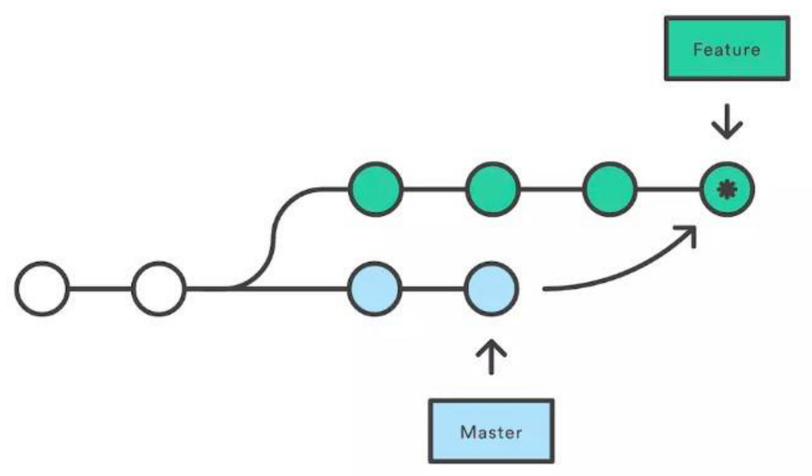
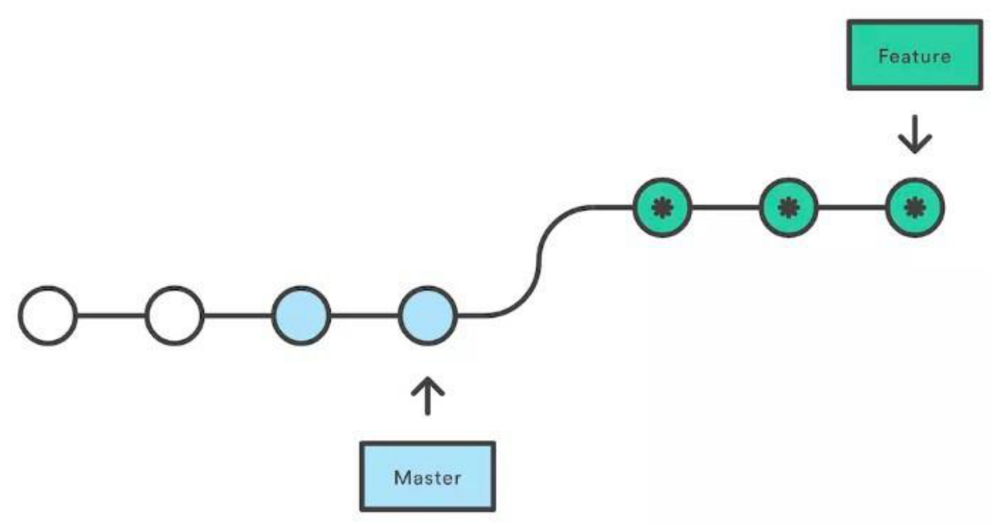

# GIT 相关

## 你们的 Git 工作流是什么样的？

每个公司采用的 Git 工作流都可能会有差别，有的比较规范，有的比较随意。在这里介绍一个名为 GitFlow 的 git 标准操作流程。

在 GitFlow 标准下，我们的 git 仓库需要包含以下几个关键分支：

- master：主分支
- develop：主开发分⽀。包含确定即将发布的代码
- feature：新功能分⽀。⼀个新功能对应⼀个分⽀
- release：发布分⽀。发布时⽤的分⽀，⼀般测试阶段发现的 bug 在这个分⽀进⾏修复
- hotfix：热补丁分支。用于修改在线上版本中发现的严重紧急 bug

**GitFlow 的主要优点**

1. 支持并⾏开发

因为每个新功能都会建⽴⼀个新的 feature 分⽀，从⽽和其他已经完成的功能隔离开，且当只有在新功能完成开发的情况下，其对应的 feature 分⽀才会被合并到主开发分⽀（develop 分支）。

另外，如果你正在开发某个功能的同时⼜有⼀个新功能需要开始开发，那么你只需把当前 feature 的代码提交后，新建另外⼀个 feature 分⽀即可开发新功能了。

你也可以随时切回之前的其他 feature 分⽀继续完成该功能的开发。

- 协作开发

因为每个 feature 分⽀上改动的代码都只对该 feature 对应的功能生效，所以不同 feature 分支上的代码在开发时不会互相影响，大家可以相安无事的开发自己负责的功能。

同时我们可以根据分支的名称，很容易知道每个⼈都在做什么功能。

- 发布阶段

当⼀个新 feature 开发完成时，它会被合并到 develop 分⽀，这就意味着 develop 分支上包含了所有已经开发完成的功能。

因此，在开发新的 feature 时，我们只需从 develop 分⽀来创建新的分⽀，即可在新的 feature 分支中包含所有已完成的最新功能。

- ⽀持紧急修复

hotfix 分⽀是从某个已经发布的 Tag 上创建出来来，用于紧急修复 Bug。

该紧急修复只影响这个已经发布的 Tag，⽽不会影响你正在开发的其他新 feature 。

**注意点**

1. feature 分⽀都是从 develop 分⽀上创建的，开发完成后再合并到 develop 分⽀上，等待发布

2. 当需要发布时，我们要从 develop 分⽀上创建⼀个 release 分⽀，然后该 release 分⽀会发布到测试环境进⾏测试。如果发现问题的话，就会直接在该分⽀上进⾏修复。所有问题修复之前，会不停重复 `发布` > `测试` > `修复` > `重新发布` > `重新测试` 流程。 发布结束，该 release 分⽀会被合并到 develop 以及 master 分⽀，从⽽保证不会有代码丢失

3. master 分⽀只跟踪已经发布的代码，合并到 master 上的 commit 只能来⾃ release 分⽀和 hotfix 分⽀

4. hotfix 分⽀的作⽤是紧急修复⼀些 Bug，它们都是从 master 分⽀上的某个 Tag 建⽴，修复结束后再会被合并到 develop 和 master 分⽀上

[参考文章：Git 工作流](https://www.ruanyifeng.com/blog/2015/12/git-workflow.html)

## Git 的 rebase 和 merge 的区别是什么？

`git rebase` 和 `git merge` 两个命令都⽤于从⼀个分⽀获取内容并合并到当前分⽀。

以一个 `feature/todo` 分⽀合并到 `master`主分⽀为例，我们来看一下分别⽤ `rebase` 和 `merge` 会有什么不同。

**使用 Merge**

`merge` 会⾃动创建⼀个新的 `commit`， 如果合并时遇到冲突的话，只需要修改后重新 `commit`。

- 优点：能记录真实的 `commit` 情况，包括每个分⽀的详情

- 缺点：由于每次 `merge` 会⾃动产⽣⼀个 `merge commit`，因此在使⽤⼀些可视化的 git 工具时会看到这些自动产生的 `commit`，这些 `commit` 对于程序员来说没有什么特别的意义，反而会影响阅读

**使用 Rebase**

`rebase` 会合并之前的 `commit` 历史。

- 优点：可以得到更简洁的提交历史，去掉了 `merge commit`

- 缺点：因为合并而产生的代码问题，就不容易定位，因为会重写提交历史信息

**建议**

- 当需要保留详细的合并信息时，建议使⽤ `git merge`，特别是需要将分⽀合并进 `master` 分⽀时

- 当发现⾃⼰修改某个功能时提交比较频繁，并觉得过多的提交信息对自己来说没有必要，那么可尝试使用 `git rebase`
