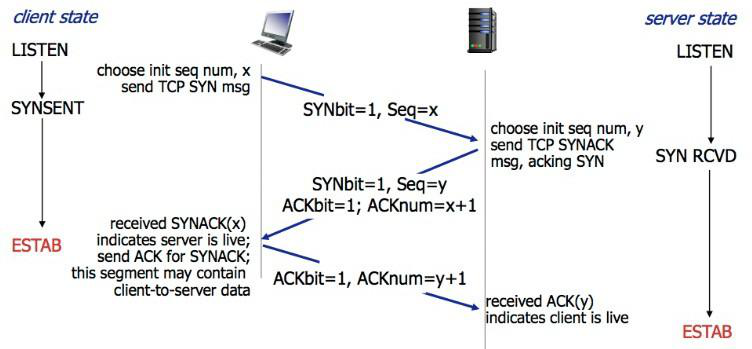

# http 相关

**Hyper Text Transfer Protocol**(HTTP)是超文本传输协议。在前端最重要的体现在于，浏览器（**HTTP Client**）与服务器（**HTTP Server**）之间的通信。

## 1. HTTP 有哪些⽅法？

HTTP 1.0 标准中，定义了 3 种请求⽅法：GET、POST、HEAD

HTTP 1.1 标准中，新增了请求⽅法：PUT、PATCH、DELETE、OPTIONS、TRACE、CONNECT

## 2. 各个 HTTP 方法的具体作用是什么？

|  方法   | 功能                                                                                                                                                                   |
| :-----: | ---------------------------------------------------------------------------------------------------------------------------------------------------------------------- |
|   GET   | 通常⽤于请求服务器发送某些资源                                                                                                                                         |
|  POST   | 发送数据给服务器                                                                                                                                                       |
|  HEAD   | 请求资源的头部信息, 并且这些头部与 HTTP GET ⽅法请求时返回的⼀致。<br />该请求⽅法的⼀个使⽤场景是在下载⼀个⼤⽂件前先获取其⼤⼩再决定是否要下载, 以此可以节约带宽资源 |
|   PUT   | ⽤于全量修改⽬标资源 (看接口, 也可以用于添加)                                                                                                                          |
| DELETE  | ⽤于删除指定的资源                                                                                                                                                     |
| OPTIONS | ⽤于获取⽬的资源所⽀持的通信选项 (跨域请求前, 预检请求, 判断目标是否安全)                                                                                              |
|  TRACE  | 该方法会 让服务器 原样返回任意客户端请求的信息内容, 用于诊断和判断                                                                                                     |
| CONNECT | HTTP/1.1 协议中预留给能够将连接改为管道⽅式的代理服务器<br />(把服务器作为跳板，让服务器代替用户去访问其它网页, 之后把数据原原本本的返回给用户)                        |
|  PATCH  | ⽤于对资源进⾏部分修改                                                                                                                                                 |

**GET/DELETE** 参数是在地址栏中传递的

**PUT/PATCH/POST** 参数是在请求体传递的

## 3. GET 方法和 POST 方法有何区别？

默认的 http 请求的内容, 在网络中传输, 明文的形式传递的 (https 对内容加密)

|                  | GET 方法                                                                                                                                               | POST 方法                                          |
| ---------------- | ------------------------------------------------------------------------------------------------------------------------------------------------------ | -------------------------------------------------- |
| **数据传输⽅式** | 通过 URL 传输数据 (地址栏拼接参数)                                                                                                                     | 通过请求体传输                                     |
| **数据安全**     | 数据暴露在 URL 中，可通过浏览历史记录、缓存等很容易查到数据信息                                                                                        | 数据因为在请求主体内，<br />所以有⼀定的安全性保证 |
| **数据类型**     | 只允许 ASCII 字符                                                                                                                                      | ⽆限制                                             |
| **GET ⽆害**     | 刷新、后退等浏览器操作是⽆害的                                                                                                                         | 可能会引起重复提交表单                             |
| **功能特性**     | 安全且幂等（这⾥的安全是指只读特性，就是使⽤这个⽅法不会引起服务器状态变化。<br />**幂等的概念是指同⼀个请求⽅法执⾏多次和仅执⾏⼀次的效果完全相同）** | ⾮安全(会引起服务器端的变化)、**⾮幂等**           |

## 4. HTTP 请求报文是什么样的？

HTTP 请求报⽂的组成：**请求⾏、请求头、(空⾏)、请求体。**

实际请求报文实例:


**请求行**

包含了请求⽅法、URL、HTTP 协议版本，它们之间⽤空格进行分隔。例如：

```bash
GET http://www.abc.com/articles HTTP/1.1
```

**请求头**

请求头由键值对组成，每⾏⼀对，键值之间⽤英⽂冒号`:`进行分隔。例如：

```
Content-Type: application/json
Host: www.abc.com
```

**请求体**

请求体中放置 POST、PUT、PATCH 等请求方法所需要携带的数据。

## 5. HTTP 响应报文是什么样的？

HTTP 响应报⽂的组成: **响应⾏、响应头、空⾏、响应体。**


**响应行**

响应行由协议版本、状态码、状态码的原因短语 3 个内容组成，中间以空格分隔。例如：

```bash
HTTP/1.1 200 OK
```

**响应头**

响应头由键值对组成，每⾏⼀对，键值之间⽤英⽂冒号`:`进行分隔。例如：

```
Content-Length: 1024
Content-Type: application/json
```

**响应体**

服务器发送过来的数据。


## 6. 你了解的 HTTP 状态码有哪些？

**成功（2XX）**

| 状态码 | 原因短语        | 说明                                                                                                                                  |
| ------ | --------------- | ------------------------------------------------------------------------------------------------------------------------------------- |
| 200    | OK              | 表示从客户端发来的请求在服务器端被正确处理                                                                                            |
| 201    | Created         | 请求已经被实现，⽽且有⼀个新的资源已经依据请求的需要⽽建⽴<br />通常是在 POST 请求，或是某些 PUT 请求之后创建了内容, 进行的返回的响应 |
| 202    | Accepted        | 请求服务器已接受，但是尚未处理，不保证完成请求<br />适合异步任务或者说需要处理时间比较长的请求，避免 HTTP 连接一直占用                |
| 204    | No content      | 表示请求成功，但响应报⽂不含实体的主体部分                                                                                            |
| 206    | Partial Content | 进⾏的是范围请求, 表示服务器已经成功处理了部分 GET 请求<br />响应头中会包含获取的内容范围 (常用于分段下载)                            |

**重定向（3XX）**

| 状态码  | 原因短语           | 说明                                                                                                                                                         |
| ------- | ------------------ | ------------------------------------------------------------------------------------------------------------------------------------------------------------ |
| 301     | Moved Permanently  | 永久性重定向，表示资源已被分配了新的 URL<br />比如，我们访问 **http**://www.baidu.com 会跳转到 **https**://www.baidu.com                                     |
| 302     | Found              | 临时性重定向，表示资源临时被分配了新的 URL, 支持搜索引擎优化<br />首页, 个人中心, 遇到了需要登录才能操作的内容, 重定向 到 登录页                             |
| 303     | See Other          | 对于 POST 请求，它表示请求已经被处理，客户端可以接着使用 GET 方法去请求 Location 里的 URI。                                                                  |
| **304** | **Not Modified**   | **自从上次请求后，请求的网页内容未修改过。<br />服务器返回此响应时，不会返回网页内容。(协商缓存)**                                                           |
| 307     | Temporary Redirect | 对于 POST 请求，表示请求还没有被处理，客户端应该向 Location 里的 URI 重新发起 POST 请求。<br />不对请求做额外处理, 正常发送请求, 请求 location 中的 url 地址 |

因为 post 请求, 是非幂等的, 从 302 中, 细化出了 303 和 307

简而言之:

- 301 302 307 都是重定向
- 304 协商缓存

**客户端错误（4XX）**

| 状态码  | 原因短语        | 说明                                        |
| ------- | --------------- | ------------------------------------------- |
| **400** | **Bad Request** | **请求报⽂存在语法错误(（传参格式不正确）** |
| 401     | UnAuthorized    | 权限认证未通过(没有权限)                    |
| 403     | Forbidden       | 表示对请求资源的访问被服务器拒绝            |
| 404     | Not Found       | 表示在服务器上没有找到请求的资源            |
| 408     | Request Timeout | 客户端请求超时                              |
| 409     | Confict         | 请求的资源可能引起冲突                      |

**服务端错误（5XX）**

| 状态码 | 原因短语                   | 说明                                                                                                     |
| ------ | -------------------------- | -------------------------------------------------------------------------------------------------------- |
| 500    | Internal Sever Error       | 表示服务器端在执⾏请求时发⽣了错误                                                                       |
| 501    | Not Implemented            | 请求超出服务器能⼒范围，例如服务器不⽀持当前请求所需要的某个功能，<br />或者请求是服务器不⽀持的某个⽅法 |
| 503    | Service Unavailable        | 表明服务器暂时处于超负载或正在停机维护，⽆法处理请求                                                     |
| 505    | Http Version Not Supported | 服务器不⽀持，或者拒绝⽀持在请求中使⽤的 HTTP 版本                                                       |

## 7. HTTP 的 keep-alive 是什么作用？

作用：使客户端到服务器端的连接**持续有效**(长连接)，当出现对服务器的后继请求时，

Keep-Alive 功能避免了建立或者重新建立连接。

早期 HTTP/1.0 在每次请求的时候，都要创建⼀个新的连接，⽽创建连接的过程需要消耗资源和时间，

为了减少资源消耗、缩短响应时间，就需要复⽤已有连接。

在后来的 HTTP/1.0 以及 HTTP/1.1 中引⼊了复⽤连接的机制，也就是在请求头中加⼊ **Connection: keep-alive**，

以此告诉对⽅这个请求响应完成后不要关闭连接，下⼀次还⽤这个请求的连接进行后续交流。

**协议规定，如果想要保持连接，则需要在请求头中加上 Connection: keep-alive。**

**keep-alive 的优点** (复用连接)

- 较少的 CPU 和内存的占⽤（因为要打开的连接数变少了, 复用了连接）
- 减少了后续请求的延迟（⽆需再进⾏握⼿）
- ...

缺点: 因为在处理的暂停期间，本来可以释放的资源仍旧被占用。请求已经都结束了, 但是还一直连接着也不合适

解决：Keep-Alive: timeout=5, max=100

- timeout：过期时间 5 秒（对应 httpd.conf 里的参数是：KeepAliveTimeout），

- max 是最多一百次请求，强制断掉连接。

  就是在 timeout 时间内又有新的连接过来，同时 max 会自动减 1，直到为 0，强制断掉。

## 8. 为什么需要 HTTPS？

HTTPS 是安全版的 HTTP。

HTTP 协议在传输数据时采用的是明⽂方式传递，因此，⼀些敏感信息的传输就变得很不安全。

而 HTTPS 就是为了解决 HTTP 的不安全⽽产⽣的。

## 9. HTTPS 是如何保证安全的？

HTTPS 在传输数据的过程中会对数据进行加密处理，保证安全性。

那 HTTPS 采用的什么样的加密方式呢？我们来了解下一些加密的基本概念。

目前常见的加密算法可以分成三类，**对称加密算法**，**非对称加密算法**和 **Hash 算法**。

### 9.1 **什么是对称加密？**

对称加密的特点是文件加密和解密使用相同的密钥，即加密密钥也可以用作解密密钥，

这种方法在密码学中叫做对称加密算法，对称加密算法使用起来简单快捷，密钥较短，且破译困难

通信的双⽅都使⽤同⼀个秘钥进⾏加解密。⽐如，两个人事先约定的暗号，就属于对称加密。


对称加密的特点是：

- 优点:

  计算量小、加密速度快、加密效率高。

- 缺点:

  在数据传送前，发送方和接收方必须商定好秘钥，然后双方保存好秘钥。

  如果一方的秘钥被泄露，那么加密信息也就不安全了

使用场景：本地数据加密、https 通信、网络传输等

常见算法：AES、DES、3DES、DESX、Blowfish、IDEA、RC4、RC5、RC6

### 9.2 **什么是⾮对称加密？**

而加密和解密其实可以使用不同的规则，只要这两种规则之间存在某种对应关系即可，

这样就避免了直接传递密钥。这种新的加密模式被称为"非对称加密算法"。

通信的双方使用不同的秘钥进行加密解密，即**秘钥对（私钥 + 公钥）**。

特征: **私钥可以解密公钥加密的内容, 公钥可以解密私钥加密的内容**


非对称加密的特点是：

- 优点：非对称加密与对称加密相比其安全性更好

- 缺点：加密和解密花费时间长、速度慢，只适合对少量数据进行加密。

使用场景：https 会话前期、CA 数字证书、信息加密、登录认证等

常见算法：RSA、ECC（移动设备用）、Diffie-Hellman、El Gamal、DSA（数字签名用）

### 9.3 **HTTPS 加密解决⽅案**

结合了两种加密⽅式：

- 将 `对称加密的密钥` ⽤非对称加密的公钥, 进⾏加密并发送出去，接收⽅使⽤私钥解密得到 `对称加密密钥`

- 双⽅沟通时使⽤ `对称加密密钥` 进⾏

**可以看到，只有在发送秘钥阶段才使用非对称加密，而后续的通信都使用对称加密，这样解决了性能问题。**

HTTPS 目前所使用的 TLS 或 SSL 协议, 就是目前采用的加密通道的规范协议

它利用对称加密、(公私钥)非对称加密, 以及其密钥交换算法，可完成可信任的信息传输

### 9.4 数字证书

为了安全性, 一般还需要签发数字证书!

客户端 和 服务器端要初步互通消息时, 客户端发送请求可以拿到公开的公钥信息

进而进行非对称加密, 使用公钥, 加密`对称加密密钥`, 传递给服务器, 后续通信都使用对称加密!

**问题是: 初步互通消息时, 如果请求拿到的公钥信息, 就是假的, 或者不安全的! 那么后续的所有操作, 都将是不安全的!**

所以, 就需要有数字证书(CA 证书), 一般是 CA 机构颁发的, 证明这个公钥是安全可靠的!

**CA 证书中心会对你网站的公钥, 网站的域名地址, 证书到期时间, 等一些相关信息一起加密签发数字证书, 保证你网站的安全性**

当公司申请了 CA 证书后, 就应该在响应时, 将数字证书一起发送给客户端

而客户端, 接收到消息后, 就可以查看证书

1. 如果正在访问的网站 和 证书记载的网址 不一致, 说明不安全, 可能被冒用, 浏览器就会发出警告!!!

2. 如果签发证书的机构, 不权威, 发出警告

3. 如果证书过期了, 浏览器也会发出警告


### 9.5 数字签名

但这还是有问题：如果证书被篡改了怎么办?

这时就需要用⼀个技术：**数字签名**。 (根据证书内容, 生成的一个唯一标识)

数字签名就是先⽤ **CA ⾃带的 Hash 算法来计算出证书内容的⼀个摘要**，然后使⽤ CA 私钥进行加密，组成数字签名。

当别⼈把他的证书发过来时，**接收方⽤同样的算法再次⽣成摘要**，⽤ CA 公钥解密后得到 CA 生成的摘要，两者进行对⽐后,

就能确定中间是否被⼈篡改。这样就能最⼤程度的保证通信的安全了。

[博客参考](https://blog.csdn.net/u014044812/article/details/80723009)

## 10. HTTP2 和 HTTP1.x 比，有什么优势和特点？

1. HTTP/2 采⽤`⼆进制格式`来传输数据，⽽⾮ HTTP 1.x 的⽂本格式，⼆进制协议`解析起来更⾼效`
2. HTTP/2 采用一些`头部压缩技术`，减少在请求和响应头中重复携带的数据，`降低网络负担`
3. HTTP/2 采⽤`服务器推送`方式，主动向客户端推送资源，提高页面加载效率
4. HTTP/2 采⽤`多路复用机制`，减少需要创建的连接数量，降低资源占用和性能消耗

下面是一些与之关联的技术知识。

**⼆进制格式分帧**

帧：HTTP/2 数据通信的最⼩单位消息，是指 HTTP/2 中逻辑上的 HTTP 消息（例如请求、响应等）。消息由⼀个或多个帧组成

流：存在于连接中的⼀个虚拟通道，它可以承载双向消息，且每个流都有唯⼀的整数 ID

**头部压缩**

在 HTTP/1.x 中，请求和响应中会重复携带一些不常改变、冗⻓的头数据，给⽹络带来额外负担。

在 HTTP/2 中，客户端和服务端使⽤ **“⾸部表”** 来跟踪和存储之前发送过的键值对，

相同的数据不再随着每次请求和响应发送。⾸部表在连接存续期间始终存在，由客户端和服务器共同渐进更新。

每个新的⾸部键值对，要么被追加到当前表的末尾，要么替换表中已存在的键值对。

> 可以简单的理解为：只发送差异数据，⽽不是全部发送，从⽽减少头部的信息量

**服务器推送**

服务端可以在发送⻚⾯ HTML 内容时，再主动推送一些其它资源，⽽不⽤等到浏览器解析到相应的位置时发起请求后再作响应。

例如，服务端可以主动把 JS 和 CSS ⽂件推送给客户端，⽽不需要客户端解析 HTML 时再发送这些请求。

不过，服务端的主动推送行为，客户端有权利选择是否要接收。

如果服务端推送的资源已经被浏览器缓存过，浏览器可以通过发送 RST_STREAM 帧来拒收。

**多路复用**

在 HTTP 1.x 中如果想并发多个请求的话，必须使⽤多个 TCP 链接，但浏览器为了控制资源，

会对单个域名有 6-8 个 TCP 链接的数量限制。而在 HTTP 2 中：

- 同域名下的所有通信，都在单个连接上完成
- 单个连接可以承载任意数量的双向数据流
- 数据流以消息的形式发送，⽽消息⼜由⼀个或多个帧组成（多个帧可以乱序发送，因为可以根据帧⾸部的流标识来重新组装）

  [参考文章：HTTP/2 特性及其在实际应用中的表现](https://zhuanlan.zhihu.com/p/30166894)

## 11. http 缓存控制

### 11.1 基本认知

**Web 服务缓存** 大致可以分为：数据库缓存、服务器端缓存（代理服务器缓存、CDN 服务器缓存）、浏览器缓存。

**浏览器缓存** 也包含很多内容： HTTP 缓存、indexDB、cookie、localstorage 等等。**`这里我们只讨论 HTTP 缓存相关内容`。**

**HTTP 缓存**:

- **强缓存**
- **协商缓存**

在具体了解 HTTP 缓存之前先来明确几个术语：

- 缓存命中率：从缓存中得到数据的请求数 与 所有请求数的比率。理想状态是越高越好。
- 过期内容：超过设置的有效时间，被标记为“陈旧”的内容。
- 验证：验证缓存中的过期内容是否仍然有效，验证通过的话刷新过期时间。
- 失效：失效就是把内容从缓存中移除。

**浏览器缓存主要是 HTTP 协议定义的缓存机制。**

**浏览器缓存, HTTP 缓存分类**

浏览器缓存分为`强缓存 `和 `协商缓存`，浏览器加载一个页面的简单流程如下：

1. 浏览器先根据这个资源的 **http 头信息** 来 **判断是否命中强缓存**。

   如果命中则直接加载在缓存中的资源，并不会将请求发送到服务器。（强缓存）

2. 如果未命中强缓存，则浏览器会将资源加载请求发送到服务器。

   服务器来判断浏览器本地缓存是否失效。

   若可以使用，则服务器并不会返回资源信息，浏览器继续从缓存加载资源。（协商缓存）

3. 如果未命中协商缓存，则服务器会将完整的资源返回给浏览器，浏览器加载新资源，并更新缓存。（新的请求）

### 11.2 强缓存 (食品过期时间判断)

**(进行判断, 是否资源过期, 如果未过期, 直接用缓存)**

**强缓存**

命中强缓存时，浏览器并不会将请求发送给服务器。

在 Chrome 的开发者工具中看到 http 的返回码是 200，但是在 Size 列会显示为(from cache)。

强缓存是利用 http 的返回的响应头中的 Expires 或者 Cache-Control (优先级更高) 两个字段来控制的，用来表示资源的缓存时间。

**Expires**: 指定一个具体时间(2020 年 12 月 12 日 17:00), 到了这个时间了, 缓存过期了, 在时间内, 都是有效的, 可以直接读

**Cache-Control** : 指定一个过期时间 (3600s), 这个资源你加载到后, 可以用 3600s

**Expires**

缓存过期时间，用来指定资源到期的时间，是服务器端的具体的时间点。也就是说，**Expires=max-age + 请求时间**，需要和 Last-modified 结合使用。但在上面我们提到过，**cache-control 的优先级更高**。

Expires 是 Web 服务器响应消息头字段，在响应 http 请求时告诉浏览器在过期时间前浏览器可以直接从浏览器缓存取数据，而无需再次请求。

该字段会返回一个时间，比如 Expires: Wed, 23 Nov 2050 16:00:01 GMT 。这个时间代表着这个资源的失效时间，也就是说在 xx 年 xx 月 xx 日时间之前都是有效的，即命中缓存。

这种方式有一个明显的缺点，由于失效时间是一个`绝对时间`，所以当 **服务器与客户端 时间偏差很大** 以后，就会导致缓存混乱。于是发展出了 Cache-Control。

**Cache-Control**

Cache-Control 是一个`相对时间`，例如 Cache-Control:max-age 3600，代表着资源的有效期是 3600 秒。

由于是相对时间，并且都是与客户端时间比较，所以服务器与客户端时间偏差也不会导致问题。

Cache-Control 与 Expires 可以在服务端配置同时启用或者启用任意一个，同时启用的时候 Cache-Control 优先级高。

Cache-Control 可以由多个字段组合而成，主要有以下几个取值：

1. **max-age** 指定一个时间长度，在这个时间段内缓存是有效的，单位是 s。

   例如设置 Cache-Control:max-age=31536000，也就是说缓存有效期为（31536000 / 24 / 60 / 60）天，

   第一次访问这个资源的时候，服务器端也返回了 Expires 字段，并且过期时间是一年后。

   在没有禁用缓存并且没有超过有效时间的情况下，再次访问这个资源就命中了缓存，不会向服务器请求资源而是直接从浏览器缓存中取。

2. **no-cache** 强制所有缓存了该响应的用户，在使用已缓存的数据前，发送带验证的请求到服务器, 问服务器是否可以读缓存。

   不是字面意思上的不缓存。

3. **no-store** 禁止缓存，每次请求都要向服务器重新获取数据。

### 11.3 协商缓存 (找供货商专家协商)

看看过期时间, 食品没过期, 直接吃 (直接读缓存, 不发请求) 强缓存

食品过期时间过了, 能不能吃呢? 问问专家(服务器), 专家瞅了一眼, 没过期 (响应 304, 不返回内容) , 直接吃 (协商缓存)

如果问过专家(服务器), 专家瞅了一眼, 呀真过期了, 原来的不要了, 我重新给你发一个 (响应 200, 并返回内容)

**协商缓存**

若未命中强缓存(强缓存过期了)，则浏览器会将请求发送至服务器。

服务器根据 http 头信息中的`Last-Modify/If-Modify-Since`或`Etag/If-None-Match`来判断是否命中协商缓存。

**如果命中，则 http 返回码为 304 (你本地之前加载的资源是有效的)，浏览器从缓存中加载资源。**
**Last-Modify/If-Modify-Since**

浏览器第一次请求一个资源的时候, 服务器返回的 header 中会加上 Last-Modify，

Last-modify 是一个时间标识该资源的**最后修改时间**，例如`Last-Modify: Thu,31 Dec 2037 23:59:59 GMT`。

当浏览器再次请求该资源时，发送的请求头中会包含 If-Modify-Since，**该值为缓存之前返回的 Last-Modify**。

服务器收到 If-Modify-Since 后，根据实际服务器的资源的最后修改时间, 进行判断是否命中缓存。


如果命中缓存，则返回 **http304**，并且不会返回资源内容，并且不会返回 Last-Modify。

由于对比的是服务端时间，所以客户端与服务端时间差距不会导致问题。

**但是有时候通过最后修改时间来判断资源是否修改还是不太准确（资源变化了最后修改时间也可以一致）。**

比如: 最后修改只能精确到秒级, 一秒进行了多次修改, 就不行了, **于是出现了 ETag/If-None-Match。**

**ETag/If-None-Match**

与 Last-Modify/If-Modify-Since (最后修改时间)不同的是，Etag/If-None-Match 返回的是一个校验码（ETag: entity tag）。

ETag 可以保证每一个资源是唯一的，资源变化都会导致 ETag 变化。

ETag 值的变更则说明资源状态已经被修改。

服务器根据浏览器上发送的 If-None-Match 值来判断是否命中缓存。

ETag 生成靠以下几种因子

1. 文件的 i-node 编号，是 Linux/Unix 用来识别文件的编号。

2. 文件最后修改时间

3. 文件大小

   ...

生成 Etag 的时候，可以使用其中一种或几种因子，使用抗碰撞散列函数来生成。生成一个标记文件的唯一值

**既生 Last-Modified 何生 Etag ？**

你可能会觉得使用 Last-Modified 已经足以让浏览器知道本地的缓存副本是否足够新，为什么还需要 Etag（实体标识）呢？

Etag 的出现主要是为了解决几个 Last-Modified 比较难解决的问题：

1. Last-Modified 标注的最后修改只能精确到秒级

   如果某些文件在 1 秒钟以内，被修改多次的话，它将不能准确标注文件的修改时间

2. 有可能存在服务器没有准确获取文件修改时间，或者与代理服务器时间不一致等情形

Etag 是服务器自动生成或者由开发者生成的对应资源在服务器端的唯一标识符，能够更加 **准确的控制缓存。**

不会仅仅只根据最后的修改时间判断是否进行使用缓存

Last-Modified 与 ETag 是可以一起使用的，服务器会优先验证 ETag，一致的情况下，才会继续比对 Last-Modified，

最后才决定是否返回 304。

### 总结：

- 强缓存: 大大的减少了 服务器的请求次数, 在过期时间内, 直接从客户端内存中读

- 协商缓存: 强缓存命中失效了, 超过过期时间了, 拿着标识(最后的修改时间, 唯一标识 etag), 去问服务器, 是否真的过期了

  如果验证通过, 服务器会直接响应 304, 且不会返回资源

# TCP

## 12. TCP 的特性

主要有以下 5 点特性：

1. TCP 提供⼀种⾯向连接的、可靠的字节流服务

2. 在⼀个 TCP 连接中，仅有两⽅进⾏彼此通信（⼴播和多播不能⽤于 TCP）

3. TCP 使⽤校验、确认和重传机制来保证可靠传输

4. TCP 将数据分节进⾏排序，并使⽤累积来确认保证数据的顺序不变和⾮重复

5. TCP 使⽤滑动窗⼝机制来实现流量控制，通过动态改变窗⼝的⼤⼩进⾏拥塞控制

## 13. 简述 TCP 和 UDP 的区别

| 协议 | 连接性   | 双工性     | 可靠性                 | 有序性              | 有界性             | 拥塞控制 | 传输速度 | 量级 | 头部大小   |
| ---- | -------- | ---------- | ---------------------- | ------------------- | ------------------ | -------- | -------- | ---- | ---------- |
| TCP  | ⾯向连接 | 全双工 1:1 | 可靠，有重传机制       | 有序，通过 SYN 排序 | 无边界，有粘包情况 | 有       | 慢       | 低   | 20~60 字节 |
| UDP  | 无连接   | n:m        | 不可靠，丢包后数据丢失 | 无序                | 有边界，无粘包     | 无       | 快       | 高   | 8 字节     |

UDP socket ⽀持 n 对 m 的连接状态。在 Node.js 官⽅⽂档中有写到在 `dgram.createSocket(options[, callback]) ` 中的 `options` 中可指定 `reuseAddr` 为 `SO_REUSEADDR` 标志，通过它可以简单的实现 n 对 m 的多播特性 (仅在⽀持多播的操作系统上才有用)。

## 14. 什么是 TCP 粘包，怎么处理？

TCP 连接在默认情况下会启⽤延迟传送算法 (Nagle 算法)，它在数据发送前进行缓存数据，如短时间内有多个数据发送，会缓冲后再作⼀次发送操作 (缓冲区⼤⼩可⻅ `socket.bufferSize`)，这样可以减少 IO 产生的消耗，提⾼了性能。

在传输⽂件的情况下，不⽤处理粘包问题，接收到⼀个包就拼接⼀个包就行了。但是，如果是传输多条消息、或是别的⽤途的数据，那么就需要处理粘包。可参⻅⽹上流传甚⼴的⼀个例⼦：连续调⽤两次 `send` 分别发送两段数据 data1 和 data2，则在接收端会有以下⼏种常⻅情况出现:

- A. 先收到 data1，然后收到 data2

- B. 先收到 data1 的部分数据，然后收到 data1 余下的部分以及 data2 的全部

- C. 先收到 data1 的全部数据和 data2 的部分数据，然后收到 data2 的余下的数据

- D. ⼀次性收到 data1 和 data2 的全部数据

以上情况中的 `B、C、D` 三种，就是常⻅的粘包情况。而处理粘包问题的常⻅⽅案有：

**方案一：多次发送之前间隔⼀个等待时间**

只需等待⼀段时间再做下⼀次`send` 发送操作就可以了。

- 它适⽤于交互频率特别低的场景

- 对于交互频繁的场景来说， 其传输效率太低。

**方案二：关闭 Nagle 算法**

在 Node.js 中你可以通过 `socket.setNoDelay()` ⽅法来关闭 Nagle 算法，让每次 send 都不缓冲而直接发送。

- 该⽅法适⽤于每次发送的数据都⽐较⼤ (但不是如⽂件那么⼤)， 并且频率不特别⾼的场景
- 如果是每次发送的数据量⽐较⼩且频率特别⾼的话，这种方式纯属⾃废武功

- 该⽅法也不适⽤于⽹络较差的情况，因为 Nagle 算法是在服务端进⾏的包合并情况，但如果短时间内客户端的⽹络

情况不好、或者应⽤层由于某些原因不能及时将 TCP 的数据 `recv`，就会造成多个包在客户端缓冲从⽽粘包的情况

**方案三：进⾏封包/拆包**

这是⽬前业内最常⻅的解决⽅案，即在发送每个数据包之前，将⼀些有特征的数据放在数据包前/后，然后在收到数据的时候，根据特征数据来分割出各个数据包。

## 15. 一次完整的 HTTP 服务过程是什么

当我们在 web 浏览器的地址栏中输入：`www.baidu.com`，具体发生了什么？

1. 对`www.baidu.com`这个网址进行 DNS 域名解析，得到对应的 IP 地址
2. 根据这个 IP，找到对应的服务器，发起 TCP 的三次握手 ([tcp 三次握手四次挥手](https://blog.csdn.net/qq_38950316/article/details/81087809) )
3. 建立 TCP 连接后发起 HTTP 请求
4. 服务器响应 HTTP 请求，浏览器得到 html 代码
5. 浏览器解析 html 代码，并请求 html 代码中的资源（如 js、css、图片等）（先得到 html 代码，才能去找这些资源）
6. 浏览器对页面进行渲染呈现给用户
7. 服务器关闭 TCP 连接

注：

1.DNS 怎么找到域名的？

> DNS 域名解析采用的是递归查询的方式，过程是，先去找 DNS 缓存->缓存找不到就去找根域名服务器->根域名又会去找下一级，这样递归查找之后，找到了，给我们的 web 浏览器

2.为什么 HTTP 协议要基于 TCP 来实现？

> TCP 是一个端到端的可靠面向连接的协议，HTTP 基于传输层 TCP 协议不用担心数据传输的各种问题（当发生错误时，可以重传）

3.最后一步浏览器是如何对页面进行渲染的？

> a）解析 html 文件构成 DOM 树
> b）解析 CSS 文件构成渲染树
> c）边解析，边渲染
> d）JS 单线程运行，JS 有可能修改 DOM 结构，意味着 JS 执行完成前，后续所有资源的下载是没有必要的，所以 JS 是单线程，会阻塞后续资源下载

## 16. 什么是 DNS 解析

**DNS 解析（域名解析服务器）**

假定请求的是 www.baidu.com

a）首先会搜索浏览器自身的 DNS 缓存（缓存时间比较短，大概只有 1 分钟，且只能容纳 1000 条缓存）

b）如果浏览器自身的缓存里面没有找到，那么浏览器会搜索系统自身的 DNS 缓存

c）如果还没有找到，那么尝试从 hosts 文件里面去找

d）在前面三个过程都没获取到的情况下，就递归地去域名服务器去查找(就近查找)，具体过程如下

DNS 优化两个方面：DNS 缓存、DNS 负载均衡 (准备多台 dns 服务器, 进行 dns 解析)

## 16. 什么是三次握手？

三次握⼿（Three-way Handshake）是指在建⽴⼀个 TCP 连接时，需要客户端和服务器总共发送 3 个包。

三次握⼿的⽬的是连接服务器指定端⼝，建⽴ TCP 连接，并同步连接双⽅的序列号和确认号，交换 TCP 窗⼝⼤⼩信息。在 socket 编程中，客户端调用执行 `connect()` 时将触发三次握⼿。

下图为三次握手的示意图：



**第⼀次握⼿（SYN=1, seq=x）**

客户端发送⼀个 TCP 的 SYN 标志位置 1 的包，指明客户端打算连接的服务器的端⼝，以及初始序号 X，保存在包头的序列号（Sequence Number）字段⾥。

发送完毕后，客户端进⼊ SYN_SEND 状态。

**第⼆次握⼿（SYN=1, ACK=1, seq=y, ACKnum=x+1）**

服务器发回确认包（ACK）应答。即 SYN 标志位和 ACK 标志位均为 1。服务器端选择⾃⼰ ISN 序列号，放到 Seq 域⾥，同时将确认序号（Acknowledgement Number）设置为客户的 ISN 加 1，即 X + 1。

发送完毕后，服务器端进⼊ SYN_RCVD 状态。

**第三次握⼿（ACK=1，ACKnum=y+1）**

客户端再次发送确认包(ACK)，SYN 标志位为 0，ACK 标志位为 1，并且把服务器发来 ACK 的序号字段+1，放在确定字段中发送给对⽅，并且在数据段放写 ISN 的 +1。

发送完毕后，客户端进⼊ ESTABLISHED 状态，当服务器端接收到这个包时，也进⼊ ESTABLISHED 状态，TCP 握⼿结束。

## 什么是四次挥手？

四次挥⼿（Four-way handshake），也叫做改进的三次握⼿，TCP 连接的拆除需要发送四个包，客户端或服务器均可主动发起挥⼿动作，在 socket 编程中，任何⼀⽅执⾏ `close()` 操作即可产⽣挥⼿操作。

下图为四次挥手示意图：


**第⼀次挥⼿（FIN=1，seq=x）**

假设客户端想要关闭连接，客户端发送⼀个 FIN 标志位置为 1 的包，表示⾃⼰已经没有数据可以发送了，但是仍然可以接受数据。发送完毕后，客户端进⼊ FIN_WAIT_1 状态。

**第⼆次挥⼿（ACK=1，ACKnum=x+1）**

服务器端确认客户端的 FIN 包，发送⼀个确认包，表明⾃⼰接受到了客户端关闭连接的请求，但还没有准备好关闭连接。发送完毕后，服务器端进⼊ CLOSE_WAIT 状态，客户端接收到这个确认包之后，进⼊ FIN_WAIT_2 状态，等待服务器端关闭连接。

**第三次挥⼿（FIN=1，seq=y）**

服务器端准备好关闭连接时，向客户端发送结束连接请求，FIN 置为 1。发送完毕后，服务器端进⼊ LAST_ACK 状态，等待来⾃客户端的最后⼀个 ACK。

**第四次挥⼿（ACK=1，ACKnum=y+1）**

客户端接收到来⾃服务器端的关闭请求，发送⼀个确认包，并进⼊ TIME_WAIT 状态，等待可能出现的要求重传的 ACK 包。服务器端接收到这个确认包之后，关闭连接，进⼊ CLOSED 状态。客户端等待了某个固定时间（两个最⼤段⽣命周期，2MSL，2 Maximum Segment Lifetime）之后，没有收到服务器端的 ACK ，认为服务器端已经正常关闭连接，于是⾃⼰也关闭连接，进⼊ CLOSED 状态。

## 17. TCP 三次握手理解 (双方确认)

TCP 是一个端到端的 **可靠** 面相连接的协议，

HTTP 基于传输层 TCP 协议不用担心数据传输的各种问题（当发生错误时，可以重传）

根据这个 IP，找到对应的服务器，发起 TCP 的三次握手 ([tcp 三次握手四次挥手](https://blog.csdn.net/qq_38950316/article/details/81087809) )


