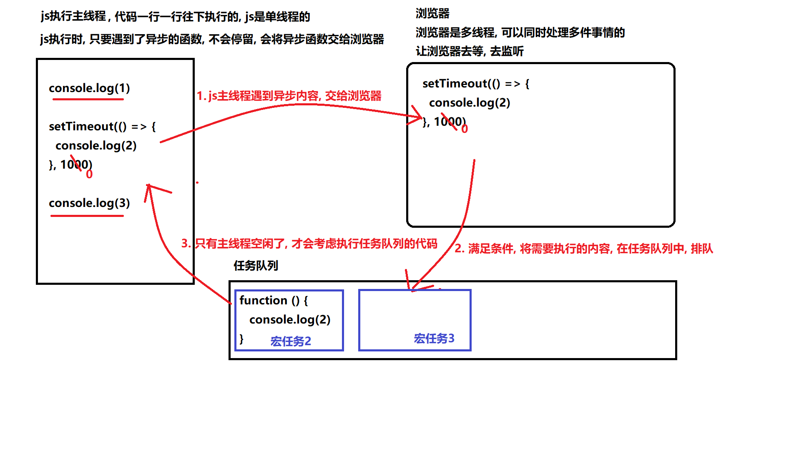

# JavaScript 基础

## 1. 解释下什么是变量声明提升？

变量提升（hoisting），是负责解析执行代码的 JavaScript 引擎的工作方式产生的一个特性。

> JS 引擎在运行一份代码的时候，会按照下面的步骤进行工作：

1. 首先，对代码进行预解析，并获取声明的所有变量

2. 然后，将这些变量的声明语句统一放到代码的最前面

3. 最后，开始一行一行运行代码

> 变量的这一转换过程，就被称为变量的声明提升。

而这是不规范, 不合理的, 我们用的 **let** 就没有这个变量提升的问题

## 2. JS 的参数是以什么方式进行传递的？

**基本类型：是值传递**！

**复杂类型: 传递的是地址! (变量中存的就是地址)**

修改参数属性值的话，改变的依然是原地址中的对象本身

```js
let a = {
  count: 1,
};
function test(x) {
  x.count = 10;
  console.log(x);
}
test(a); // { count: 10 }
console.log(a); // { count: 10 }
```

因为当我们直接为这个形参变量重新赋值时，其实只是让形参变量指向了别的堆内存地址，而外部实参变量的指向还是不变的。

```js
let a = {
  count: 1,
};

function test(x) {
  x = { count: 20 };
  console.log(x);
}

test(a); // { count: 20 }
console.log(a); // { count: 1 }
```

## 3. JavaScript 垃圾回收是怎么做的？

JS 中内存的分配和回收都是自动完成的，内存在不使用的时候会被垃圾回收器自动回收。

### 3.1 内存的生命周期

JS 环境中分配的内存, 一般有如下生命周期：

1. 内存分配：当我们声明变量、函数、对象的时候，系统会自动为他们分配内存

2. 内存使用：即读写内存，也就是使用变量、函数等

3. 内存回收：使用完毕，由垃圾回收自动回收不再使用的内存

   **全局变量一般不会回收, 一般局部变量的的值, 不用了, 会被自动回收掉**

### 3.2 垃圾回收算法说明

所谓垃圾回收, 核心思想就是如何判断内存是否已经不再会被使用了, 如果是, 就视为垃圾, 释放掉
常见的浏览器垃圾回收算法: 引用计数 和 标记清除法

### 3.3 引用计数

IE 采用的引用计数算法, 定义“内存不再使用”的标准很简单，就是看一个对象是否有指向它的引用。

如果没有任何变量指向它了，说明该对象已经不再需要了。

```jsx
// 创建一个对象person, person指向一块内存空间, 该内存空间的引用数 +1
let person = {
  age: 22,
  name: "ifcode",
};

let p = person; // 两个变量指向一块内存空间, 该内存空间的引用数为 2
person = 1; // 原来的person对象被赋值为1，对象内存空间的引用数-1,
// 但因为p指向原person对象，还剩一个对于对象空间的引用, 所以对象它不会被回收

p = null; // 原person对象已经没有引用，会被回收
```

由上面可以看出，引用计数算法是个简单有效的算法。

**但它却存在一个致命的问题：循环引用。**

如果两个对象相互引用，尽管他们已不再使用，垃圾回收器不会进行回收，导致内存泄露。

```js
function cycle() {
  let o1 = {};
  let o2 = {};
  o1.a = o2;
  o2.a = o1;
  return "Cycle reference!";
}

cycle();
```


### 3.4 标记清除算法

现代的浏览器已经不再使用引用计数算法了。

**现代浏览器通用的大多是基于标记清除算法的某些改进算法，总体思想都是一致的。**

标记清除法:

- 标记清除算法将“不再使用的对象”定义为“无法达到的对象”。

- 简单来说，就是从根部（在 JS 中就是全局对象）出发定时扫描内存中的对象。

- 凡是能从根部到达的对象，都是还需要使用的。那些无法由根部出发触及到的对象被标记为不再使用，稍后进行回收。

从这个概念可以看出，无法触及的对象包含了没有引用的对象这个概念（没有任何引用的对象也是无法触及的对象）。

根据这个概念，上面的例子可以正确被垃圾回收处理了。

参考文章：[JavaScript 内存管理](https://www.jianshu.com/p/84a8fd5fa0ee)

## 4. 谈谈你对 JavaScript 作用域链的理解？

JavaScript 在执⾏过程中会创建一个个的**可执⾏上下⽂**。 (每个函数执行都会创建这么一个可执行上下文)

每个可执⾏上下⽂的词法环境中包含了对外部词法环境的引⽤，可通过该引⽤来获取外部词法环境中的变量和声明等。

**这些引⽤串联起来，⼀直指向全局的词法环境，形成一个链式结构，被称为作⽤域链。**

简而言之: <font color='blue'>**函数内部 可以访问到 函数外部作用域的变量, 而外部函数还可以访问到全局作用域的变量，**</font>这样的变量作用域访问的链式结构, 被称之为作用域链

js 全局有全局可执行上下文, 每个函数调用时, 有着函数的可执行上下文, 会入 js 调用栈

每个可执行上下文, 都有着对于外部上下文词法作用域的引用, 外部上下文也有着对于再外部的上下文词法作用域的引用

**=> 就形成了作用域链**

## 5. 谈谈你对原型链的理解

要讲清楚这个问题，主要着重这几个方面：

- 什么是原型对象
- 构造函数, 原型对象, 实例的三角关系图
- 原型链如何形成
  

**原型对象**

在 JavaScript 中，除去一部分内建函数，绝大多数的函数都会包含有一个叫做 `prototype` 的属性，指向原型对象，

基于构造函数创建出来的实例, 都可以共享访问原型对象的属性。

例如我们的 `hasOwnProperty`, `toString` ⽅法等其实是 Obejct 原型对象的方法，它可以被任何对象当做⾃⼰的⽅法来使⽤。

`hasOwnProperty` 用于判断, 某个属性, 是不是自己的 (还是原型链上的)

**原型链**

在 JavaScript 中，每个对象中都有一个 `__proto__` 属性，这个属性指向了当前对象的构造函数的原型。

对象可以通过自身的 `__proto__`属性与它的构造函数的原型对象连接起来，

而因为它的原型对象也有 `__proto__`，因此这样就串联形成一个链式结构，也就是我们称为的原型链。


## 6. 谈谈你对闭包的理解？

这个问题想考察的主要有两个方面：

- 对闭包的基本概念的理解
- 对闭包的作用的了解

**什么是闭包？**

MDN 的官方解释：

> 闭包是函数和声明该函数的词法环境的组合

更通俗一点的解释是：

> <font color='blue'>内层函数, 引用外层函数上的变量, 就可以形成闭包</font>

**闭包的主要作用是什么？**
在实际开发中，闭包最大的作用就是用来 <font color='red'> **变量私有**</font>。

```js
function Person() {
  // 以 let 声明一个局部变量，而不是 this.name
  // this.name = 'zs'     =>  p.name
  let name = "hm_programmer"; // 数据私有
  this.getName = function () {
    return name;
  };
  this.setName = function (value) {
    name = value;
  };
}
// new:
// 1. 创建一个新的对象
// 2. 让构造函数的this指向这个新对象
// 3. 执行构造函数
// 4. 返回实例
const p = new Person();
console.log(p.getName()); // hm_programmer
p.setName("Tom");
console.log(p.getName()); // Tom
p.name; // 访问不到 name 变量：undefined
```

在此示例中，变量 `name` 只能通过 Person 的实例方法进行访问，外部不能直接通过实例进行访问，形成了一个私有变量。

## 7. 谈谈对于继承的理解

让多个构造函数之间建立关联, 便于管理和复用

代码层面的继承: 继承一些属性和方法

### 7.1 继承 - 原型继承

**原型继承: 通过改造原型链, 利用原型链的语法, 实现继承方法!**

> 语法: 子构造函数.prototype = new 父构造函数()

### 7.2 继承 - 组合继承

组合继承有时候也叫伪经典继承，指的是将原型链 和 借用构造函数 call 技术组合到一块，

从而发挥二者之长的一种继承模式，其背后的思路: **是使用原型链实现对原型属性和方法的继承 (主要是方法)，**

> 方法通过 原型继承

> 属性通过 父构造函数的.call(this, name, age)

**而通过借用构造函数来实现对实例属性构造的继承**。这样既通过在原型上定义方法实现了函数复用，又能保证每个实例都有它的自己的属性。

### 7.3 继承 - 寄生组合继承

student 实例上有 name age, 而原型 `__proto__`上不需要再有这些属性, 所以利用 Object.create 改装下

**Object.create(proto,propertiesObject) 方法:** 用于创建一个新对象，使用现有的对象来作为新创建对象的原型（prototype）。

> 1. proto: 新创建对象的原型对象。

> 2. propertiesObject: 可选，如果该参数被指定且不为 undefined，则该传入对象的自有可枚举属性 **（即其自身定义的属性，而不是其原型链上的枚举属性）** 将为新创建的对象添加指定的属性值和对应的属性描述符。这些属性对应于 Object.defineProperties() 的第二个参数。

> 3. Object.create(null): 用此初始化一个新对象，至于为什么用这个方法而不用 new Object 或者 {}，是因为无论 new 还是字面量，都是继承自 Object 构造函数，而使用 Object.create(null) ，能得到一个没有任何继承痕迹的对象

```js
var obj = Object.create({ name: "johan", age: 23 }); // obj 继承了属性name 和 age
var obj2 = Object.create(null); // obj2 不继承任何属性和方法
var obj3 = Object.create(Object.prototype); // 与 {} 和 new Object() 一个意思
var obj4 = Object.create(
  {},
  {
    property1: {
      value: true,
      writable: true,
    },
  }
); // 第二个参数与 Object.defineProperties() 一致
```

[参考文章 Object.create()](https://zhuanlan.zhihu.com/p/559527875)

分析需求:

​ 人类, 属性: name, age

​ 学生, 属性: name, age, className

​ 工人, 属性: name, age, companyName

无论学生, 还是工人, => 都是人类, 所以人类原型上有的方法, 他们都应该要有

```js
// 1. 定义Person构造函数
function Person(name, age) {
  this.name = name;
  this.age = age;
}
Person.prototype.say = function () {
  console.log("人类会说话");
};

// 2. 定义Student构造函数
function Student(name, age, className) {
  Person.call(this, name, age); // 实现构造属性的继承
  this.className = className;
}

// 3. 原型继承: 利用原型链, 继承于父级构造函数, 继承原型上的方法
// 语法: 子构造函数.prototype = new 父构造函数()
// Student.prototype = new Person()
// 通过 Object.create() 方法用于创建一个新对象，继承自 Person.prototype
Student.prototype = Object.create(Person.prototype);
Student.prototype.study = function () {
  console.log("学生在学习");
};

let stu = new Student("张三", 18, "80期");
stu.say();
console.log(stu);
```

### 7.4 es6 - class 实现继承 extends

**extends**: 继承关键字

**super()**: extends 中, 必须调用 super(), 会触发执行父类的构造函数

```js
class Person {
  constructor(name, age) {
    this.name = name;
    this.age = age;
  }
  jump() {
    console.log("会跳");
  }
}

class Teacher extends Person {
  constructor(name, age, lesson) {
    super(name, age); // extends 中, 必须调用 super(), 会触发执行父类的构造函数
    this.lesson = lesson;
    console.log("构造函数执行了");
  }
  sayHello() {
    console.log("会打招呼");
  }
}

let teacher1 = new Teacher("zs", 18, "体育");
console.log(teacher1);
```

## 8. 如何判断是否是数组？

方法一：使用 `toString` 方法

```js
function isArray(arg) {
  return Object.prototype.toString.call(arg) === "[object Array]";
}

let arr = [1, 2, 3];
isArray(arr); // true
```

方法二：使用 ES6 新增的 `Array.isArray` 方法

```js
let arr = [1, 2, 3];
Array.isArray(arr); // true
```

## 9. 谈谈你对 this 的理解？

`this` 是一个在运行时才进行绑定的引用，在不同的情况下它可能会被绑定不同的对象。


**9.1 默认绑定** (指向 window 的情况) (函数调用模式 fn() )

默认情况下，`this` 会被绑定到全局对象上，比如在浏览器环境中就为`window`对象，在 node.js 环境下为`global`对象。

**9.2 隐式绑定** (谁调用, this 指向谁) (方法调用模式 obj.fn() )

如果函数的调用是从对象上发起时，则该函数中的 `this` 会被自动隐式绑定为对象

**9.3 显式绑定** (又叫做硬绑定) (上下文调用模式, 想让 this 指向谁, this 就指向谁)

> 硬绑定 => call apply bind

call 、bind 、 apply 这三个函数的**第一个参数都是 this 的指向对象**，第二个参数差别就来了：

- <font color="red">call</font> 的参数是直接放进去的，第二第三第 n 个参数全都用逗号分隔，直接放到后面 obj.myFun.call(db,'成都', ... ,'string' )。

**应用场景: 经常做继承.**

- <font color="green">apply</font> 的所有参数都必须放在一个**数组**里面传进去 obj.myFun.apply(db,['成都', ..., 'string' ])。

**应用场景: 经常跟数组有关系**

- <font color="blue">bind</font> 除了返回是函数以外，它 的参数和 call 一样。

bind() 方法不会调用函数,但是能改变函数内部 this 指向,返回的是原函数改变 this 之后产生的新函数

**应用场景:不调用函数,但是还想改变 this 指向**

当然，三者的参数不限定是 string 类型，允许是各种类型，包括函数 、 object 等等！

[参考文章 call apply bind](https://www.runoob.com/w3cnote/js-call-apply-bind.html)

**9.4 new 绑定** (构造函数模式)

另外，在使用 `new` 创建对象时也会进行 `this` 绑定

当使用 `new` 调用构造函数时，会创建一个新的对象并将该对象绑定到构造函数的 `this` 上：

**9.5 箭头函数中的 this**：没有属于⾃⼰的 `this`,捕获其外层 上下⽂的 `this`

它所谓的 `this` 是, 捕获其外层 上下⽂的 `this` 值作为⾃⼰的 `this` 值。

并且由于箭头函数没有属于⾃⼰的 `this` ，它是不能被 `new` 调⽤的。

```js
// 转换前的 ES6 代码
const obj = {
  test() {
    return () => {
      console.log(this === obj);
    };
  },
};
// 转换后的 ES5 代码
var obj = {
  test: function getArrow() {
    var that = this;
    return function () {
      console.log(that === obj);
    };
  },
};
```

## 10. Promise 的静态方法

promise 的三个状态: `pending(默认) fulfilled(成功) rejected(失败)`

1. resolve 函数被执行时, 会将 promise 的状态从 pending 改成 fulfilled 成功
2. reject 函数被执行时, 会将 promise 的状态从 pending 改成 rejected 失败

**Promise.all([promise1, promise2, promise3])** 等待原则, 全部正确（resolve），在所有 promise 都完成后执行, 可以用于处理一些`并发的任务`

```js
// 后面的.then中配置的函数, 是在前面的所有promise都完成后执行, 可以用于处理一些并发的任务
Promise.all([promise1, promise2, promise3]).then((values) => {
  // values 是一个数组, 会收集前面promise的结果 values[0] => promise1的成功的结果
});
```

**Promise.race([promise1, promise2, promise3])** 赛跑, 竞速原则, 只要三个 promise 中有一个满足条件, 就会执行.then(用的较少)

## 11. 宏任务 微任务 是什么

> 它执行所有处于等待中的 JavaScript 任务（宏任务），然后是微任务，然后在开始下一次循环之前执行一些必要的渲染和绘制操作。 网页或者 app 的代码和浏览器本身的用户界面程序运行在相同的 **线程**中，共享相同的 事件循环。

> 每次当一个任务退出且执行上下文为空的时候，微任务队列中的每一个微任务会依次被执行。**不同的是它会等到微任务队列为空才会停止执行——即使中途有微任务加入。**

> 换句话说，微任务可以添加新的微任务到队列中，并在下一个任务开始执行之前且当前事件循环结束之前执行完所有的微任务。 由于你的代码和浏览器的用户界面运行在同一个线程中，共享同一个事件循环，假如你的代码阻塞了或者进入了无限循环，则浏览器将会卡死。…

- 宏任务: `主线程代码`,`异步 Ajax 请求` `setTimeout、setInterval`，`文件操作`等其它宏任务属于宏任务, 上一个宏任务执行完, 才会考虑执行下一个宏任务

- 微任务: `promise .then .catch和 .finally`，`process.nextTick` 等其它微任务属于微任务, 满足条件的微任务, 会被添加到当前宏任务的最后去执行


**事件循环队列 eventLoop**


[参考文章：宏任务，微任务](https://zh.javascript.info/event-loop)

## 12. async/await 是什么？

ES7 标准中新增的 `async` 函数，从目前的内部实现来说其实就是 `Generator` 函数的语法糖。

它基于 Promise，并与所有现存的基于 Promise 的 API 兼容。

**async 关键字**

1. `async` 关键字用于声明⼀个异步函数（如 `async function asyncTask1() {...}`）

2. `async` 会⾃动将常规函数转换成 Promise，返回值也是⼀个 Promise 对象

3. `async` 函数内部可以使⽤ `await`

**await 关键字**

1. `await` 用于等待异步的功能执⾏完毕 `var result = await someAsyncCall()`

2. `await` 放置在 Promise 调⽤之前，会强制 async 函数中其他代码等待，直到 Promise 完成并返回结果

3. `await` 只能与 Promise ⼀起使⽤

4. `await` 只能在 `async` 函数内部使⽤

## 13. 前端如何实现即时通讯？

基于 Web 的前端，存在以下几种可实现即时通讯的方式：

- 短轮询
- Comet
- SSE
- WebSocket

**短轮询**

短轮询就是客户端定时发送请求，获取服务器上的最新数据。不是真正的即时通讯，但一定程度上可以模拟即时通讯的效果。

优缺点：

- 优点：浏览器兼容性好，实现简单
- 缺点：实时性不高，资源消耗高，存在较多无用请求，影响性能

**Comet**

有两种实现 Comet 的方式：

1. 使用 Ajax 长轮询（long-polling）
2. 使用 HTTP 长连接（基于 iframe 和 htmlfile 的流）

优缺点：

- 优点：浏览器兼容性好，即时性好，不存在⽆⽤请求

- 缺点：服务器压力较大（维护⻓连接会消耗较多服务器资源）

[参考文章：Comet 技术详解](http://www.52im.net/thread-334-1-1.html)

**SSE**

服务端推送事件（Server-Sent Event），它是⼀种允许服务端向客户端推送新数据的 HTML5 技术。

优缺点：

- 优点：基于 HTTP，无需太多改造就能使⽤；相比 WebSocket 要简单方便很多

- 缺点：基于⽂本传输，效率没有 WebSocket ⾼；不是严格的双向通信，客户端⽆法复⽤连接来向服务端发送请求，

  而是每次都需重新创建新请求

[参考文章：SSE 教程](https://www.ruanyifeng.com/blog/2017/05/server-sent_events.html)

**WebSocket**

这是基于 TCP 协议的全新、独⽴的协议，作⽤是在服务器和客户端之间建⽴实时的双向通信。

WebSocket 协议与 HTTP 协议保持兼容，但它不会融⼊ HTTP 协议，仅作为 HTML 5 的⼀部分。

优缺点：

- 优点：真正意义上的双向实时通信，性能好、延迟低

- 缺点：由于是独⽴于 HTTP 的协议，因此要使用的话需要对项⽬作改造；使⽤复杂度较⾼，通常需要引⼊成熟的库；并且⽆法兼容低版本的浏览器

HTTP 和 WebSocket 的连接通信比较图：


## 14. 什么是浏览器的同源策略？

首先，同源是指资源地址的 "协议 + 域名 + 端⼝" 三者都相同，即使两个不同域名指向了同⼀ IP 地址，也被判断为⾮同源。

了解了什么是同源，再来说同源策略。

> 同源策略是一种⽤于隔离潜在恶意⽂件的重要安全保护机制，它用于限制从⼀个源加载的⽂档或脚本与来⾃另⼀个源的资源进⾏交互。

在浏览器中，⼤部分内容都受同源策略限制，除了以下三个标签：

- ``
- `<link>`
- `script`

## 15. 如何实现跨域？

历史上出现过的跨域⼿段有很多，本章主要介绍目前主流的 3 种跨域⽅案：

- JSONP
- CORS
- 服务器代理(webpack 代理, Nginx 反向代理)

[参考文章：跨域方式实现原理](https://juejin.cn/post/6844903767226351623#heading-19)

## 16. Babel 的原理是什么？

Babel 的主要工作是对代码进行转译。

转译分为三阶段：

- 解析（Parse），将代码解析⽣成抽象语法树 AST，也就是词法分析与语法分析的过程

- 转换（Transform），对 AST 进⾏变换方面的⼀系列操作。通过 babel-traverse，对 AST 进⾏遍历并作添加、更新、删除等操作

- ⽣成（Generate），通过 babel-generator 将变换后的 AST 转换为 JS 代码
