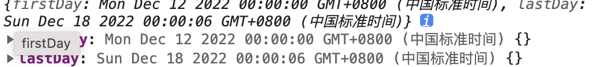

# 时间相关

## 1. 获取当天时间

```js
/*
 ** val="timeStamp" 返回时间戳 毫秒，否则返回格式为 "2022-12-09"
 */
export const getCurrentDay = (val = "timeStamp") => {
  let currentDay = new Date();
  let year = currentDay.getFullYear();
  let month = currentDay.getMonth() + 1;
  let day = currentDay.getDate();
  let newM = month >= 10 ? month : "0" + month;
  let newD = day >= 10 ? day : "0" + day;
  let date = new Date(`${year}-${newM}-${newD}`);
  let theDay = val === "timeStamp" ? date.getTime() : `${year}-${newM}-${newD}`;
  return theDay;
};
```

## 2. 根据某一天获取本周的时间戳

```js
/*
** timestamp 入参时间戳(毫秒）或者字符串格式都可以
*** getWeekdays('2022-12-7') getWeekdays(1670774400000)
 */
export function getWeekdays(timestamp) {
let date = new Date(timestamp).setHours(0, 0, 0, 0);
let dayOfToday = new Date(date).getDay();
let firstDay = new Date(date + (1 - dayOfToday) _ 86400 _ 1000);
let lastDay = new Date(date + (7 - dayOfToday) _ 86401 _ 1000);
return {
firstDay,
lastDay,
};
}
```

**结果**


> 想要获取时间戳的话 获取到返回的对象后 `/1000` 得到秒数
> 例如 `let weekFirst = getWeekdays(1670774400000).firstDay / 1000`

## 3. 根据某一天获取本月的第一天及最后一天

```js
/**
 * @description: 根据某一天获取本月的第一天及最后一天（不传默认为当前日期本月第一天）
 * @param {number} time: 某天时间
 * @param {string} formMat: 返回格式 默认毫秒
 * @Author: zhs
 * @return 毫秒数
 */
export function getMonthFrist(time, formMat = "timestamp") {
  let date = time ? new Date(time) : new Date();
  let year = date.getFullYear();
  let month = date.getMonth();
  let result = new Date(year, month, 1);
  return formMat === "timestamp" ? result.getTime() / 1000 : result;
}
// 本月最后一天
export function getMonthLast(timestamp) {
  let date = timestamp ? new Date(timestamp) : new Date();
  let year = date.getFullYear();
  let month = date.getMonth();
  // day为0表示获取一个月最后一天，所以 month+1 然后加上一天的秒数
  // 86300表示一天秒数，最后日期为 23:59:59
  return (new Date(year, month + 1, 0) / 1000 + 86399) * 1000;
}
```

## 4. 格式化时间

### 4.1 格式化时间 2021-12-31 11:25:11

```js
export function formatTime(timestamp) {
  if (!Number(timestamp)) {
    return "-";
  }
  const date = new Date(timestamp * 1000);
  const y = date.getFullYear();
  let MM = date.getMonth() + 1;
  MM = MM < 10 ? "0" + MM : MM;
  let d = date.getDate();
  d = d < 10 ? "0" + d : d;
  let h = date.getHours();
  h = h < 10 ? "0" + h : h;
  let m = date.getMinutes();
  m = m < 10 ? "0" + m : m;
  let s = date.getSeconds();
  s = s < 10 ? "0" + s : s;
  return y + "-" + MM + "-" + d + " " + h + ":" + m + ":" + s;
}
```

### 4.2 格式化时间 2021-12-31 上午

```js
export function formatTime1(timestamp) {
  if (!Number(timestamp)) {
    return "-";
  }
  const date = new Date(timestamp * 1000);
  const y = date.getFullYear();
  let MM = date.getMonth() + 1;
  MM = MM < 10 ? "0" + MM : MM;
  let d = date.getDate();
  d = d < 10 ? "0" + d : d;
  let h = date.getHours();
  h = h < 12 ? "上午" : "下午";
  return y + "-" + MM + "-" + d + " " + h;
}
```

### 4.3 格式化时间 2021-12-31

```js
export function formatTime2(timestamp) {
  if (!Number(timestamp)) {
    return "-";
  }
  const date = new Date(timestamp * 1000);
  const y = date.getFullYear();
  let MM = date.getMonth() + 1;
  MM = MM < 10 ? "0" + MM : MM;
  let d = date.getDate();
  d = d < 10 ? "0" + d : d;
  return y + "-" + MM + "-" + d;
}
```

## 5. 两日期之间相差的天数

<!-- 传入毫秒数 -->

```js
const dayDiff = (date1, date2) => {
  const d1 = date1 * 1;
  const d2 = date2 * 1;
  return Math.ceil(Math.abs(d1 - d2) / 86400000);
};
// dayDiff(1653926400000,1651248000000) => 31
// dayDiff(new Date(2022,5,0), new Date(2022,4,0));  => 31
// dayDiff(new Date("2021-10-21"), new Date("2022-02-12")) => 114;
```

## 6. 查询某天是否为工作日

```js
const isWeekday = (date) => date.getDay() % 6 !== 0;

isWeekday(new Date(2022, 03, 11));
// true
```
