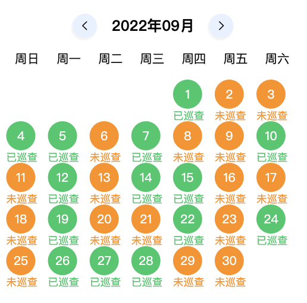

# 日历组件

## 1. 组件内容

```vue
<template>
  <view class="calendar">
    <slot name="header"> </slot>
    <view class="calendar-header">
      <view class="calendar-header-icon" @click="previousMonth">
        <text class="iconfont icon-left"></text>
      </view>
      <picker mode="date" fields="month" start="2021" @change="bindDateChange">
        <text class="fs-xxl">{{ year }}年{{ month }}月</text>
      </picker>

      <view class="calendar-header-icon" @click="nextMonth">
        <text class="iconfont icon-youjiantou"></text>
      </view>
    </view>
    <view class="calendar-content">
      <view class="calendar-week">
        <view
          class="calendar-week-item"
          :style="[
            { width: dayWidthComputed + 'px', height: dayWidthComputed + 'px' },
          ]"
          v-for="(week, index) in weekList"
          :key="index"
        >
          <text class="fs-xl calendar-week-text">{{ week }}</text>
        </view>
      </view>
      // 这里将计算的宽度 dayWidthComputed
      通过作用域插槽传出去，复杂组件可以使用
      <slot name="calendarDay" :width="dayWidthComputed">
        <view class="calendar-day">
          <view
            class="calendar-every-box"
            :style="[
              {
                width: dayWidthComputed + 'px',
                height: dayWidthComputed + 'px',
              },
            ]"
            v-for="(item, index) in 42"
            :key="index"
            v-if="item - beginDay <= endDay"
          >
            <view
              @click="getCurrentDay(item, beginDay)"
              class="calendar-every-day"
              :style="[
                {
                  width: dayWidthComputed * 0.7 + 'px',
                  height: dayWidthComputed * 0.7 + 'px',
                },
              ]"
              :class="[
                `${year}-${month}-${item - beginDay}` == curDate
                  ? 'calendar-now-day'
                  : '',
                deadLine &&
                new Date(`${year}-${month}-${item - beginDay}`) / 1000 -
                  new Date(deadLine) / 1000 >
                  0
                  ? 'deadLineStyle'
                  : '',
              ]"
              v-if="item - beginDay > 0 && item - beginDay <= endDay"
            >
              <text class="fs-xl">{{ item - beginDay }}</text>
            </view>
          </view>
        </view>
      </slot>
    </view>
  </view>
</template>

<script>
export default {
  props: {
    signs: {
      type: Array,
      default: () => [],
    },
    // 宽度，没有自适应，需要算好它占的宽度
    calendarWidth: {
      type: Number,
      default: 750,
    },
    // 截止时间
    deadLine: String | Number,
  },
  data() {
    return {
      weekList: ["周日", "周一", "周二", "周三", "周四", "周五", "周六"],
      year: null,
      month: null,
      day: null,
      // 当前日期
      curDate: null,
    };
  },
  mounted() {
    this.getInitDate();
  },
  methods: {
    // 初始化操作
    getInitDate() {
      const date = new Date();
      this.year = date.getFullYear();
      this.month =
        date.getUTCMonth() + 1 < 10
          ? "0" + (date.getUTCMonth() + 1)
          : date.getUTCMonth() + 1;
      this.day = date.getDate();
      this.curDate = `${this.year}-${this.month}-${this.day}`;
      this.$emit("getCurrentDay", this.curDate);
    },
    // 上个月
    previousMonth() {
      this.month = Number(this.month);
      if (this.month === 1) {
        this.month = 12;
        this.year--;
      } else {
        this.month =
          this.month - 1 < 10 ? "0" + (this.month - 1) : this.month - 1;
      }
      this.getCurrentDay(1, 0);
    },
    // 下个月
    nextMonth() {
      this.month = Number(this.month);
      if (this.month === 12) {
        this.month = 1;
        this.year++;
      } else {
        this.month =
          this.month + 1 < 10 ? "0" + (this.month + 1) : this.month + 1;
      }
      this.getCurrentDay(1, 0);
    },
    // 选择年月
    bindDateChange(e) {
      let [year, month] = e.detail.value.split("-");
      this.year = year;
      this.month = month;
      this.getCurrentDay(1, 0);
    },
    // 得到的时间
    getCurrentDay(item, beginDay) {
      // 	console.log(item)
      // 	console.log(beginDay)
      let selectTime = `${this.year}-${this.month}-${item - beginDay}`;
      let isThanDL =
        new Date(selectTime) / 1000 - new Date(this.deadLine) / 1000;
      // 如果传入的有截止时间 并且选择时间 > 截止时间 直接return
      if (this.deadLine && isThanDL > 0) {
        return;
      } else {
        this.curDate = selectTime;
        this.$emit("getCurrentDay", this.curDate);
      }
    },
  },
  computed: {
    dayWidthComputed() {
      return uni.upx2px(Number(this.calendarWidth) / 7);
    },
    // 每个月开始的第一天是星期几
    beginDay() {
      return new Date(this.year, this.month - 1, 1).getDay();
    },
    // 这个月一共多少天
    endDay() {
      return new Date(this.year, this.month, 0).getDate();
    },
  },
};
</script>

<style lang="scss" scoped>
.calendar {
  background-color: #fff;
}

.calendar-header {
  display: flex;
  flex-direction: row;
  justify-content: center;
  align-items: center;
}

.calendar-header-icons {
  display: flex;
  flex-direction: row;
}

.calendar-header-icon {
  width: 54rpx;
  height: 54rpx;
  display: flex;
  justify-content: center;
  align-items: center;
  background: #e8f0ff;
  box-shadow: -1px 2px 1px 1px rgba(37, 37, 37, 0.05);
  border-radius: 50%;
}

.calendar-icon {
  font-size: 40rpx !important;
}

.calendar-week {
  display: flex;
  flex-direction: row;
}

.calendar-week-item {
  display: flex;
  justify-content: center;
  align-items: center;
}

.calendar-week-text {
  color: #8c9198;
  color: #030303;
}

.calendar-day {
  display: flex;
  flex-direction: row;
  flex-wrap: wrap;
}

.calendar-every-box {
  display: flex;
  justify-content: center;
  align-items: center;
  margin-bottom: 13rpx;
}

.calendar-every-day {
  position: relative;
  display: flex;
  justify-content: center;
  align-items: center;
  color: #4483fa;
  flex-direction: column;
}

.calendar-now-day {
  background-color: $uni-main-color;
  position: relative;
  border-radius: 50%;
  color: #fff;

  &::before {
    content: "";
    position: absolute;
    bottom: -22rpx;
    left: 50%;
    transform: translateX(-50%);
    width: 10rpx;
    height: 10rpx;
    border-radius: 50%;
    background-color: #ff9100;
    color: #4483fa;
  }
}

.circle {
  position: absolute;
  bottom: -22rpx;
  left: 50%;
  transform: translateX(-50%);
  width: 10rpx;
  height: 10rpx;
  border-radius: 50%;
  background-color: #ff9100;
  color: #4483fa;
}

.deadLineStyle {
  color: #999;
}

.calendar-now-day-text {
  color: #fff;
}

.calendar-day-bottom {
  position: absolute;
  bottom: -20rpx;
  left: 0;
  width: 100%;
  height: 20rpx;
  display: flex;
  justify-content: center;
  align-items: center;
}

.calendar-sign-day {
  width: 10rpx;
  height: 10rpx;
  border-radius: 50%;
  background-color: #ff9100;
}

.fs-xxl {
  margin: 0 33rpx;
  font-size: 34rpx;
  font-weight: bold;
  color: #030303;
}
</style>
```

## 2. 使用

```js
<Calendar :calendarWidth="650" @getCurrentDay="getCurrentDay" :deadLine="currentDay" />
```

## 3. 复杂应用

> 主要就是使用了传出的 `width` 再加上日历组件本来的样式，在外面重新画了一边日历组件形式，为了不再传入组件里面遍历多次而这样使用（应该有更好的办法，还没想到）

```vue
<template>
  <Calendar
    :planList="planList"
    ref="calendarRef"
    :calendarWidth="650"
    @getCurrentDay="getCurrentDay"
  >
    <template #calendarDay="{ width }">
      <view class="slotDayBox">
        // weekDay是获取今天是周几，就在前面填补几个空白
        <view
          :style="[{ width: width + 'px', height: width + 'px' }]"
          v-for="item in weekDay"
          :key="item"
        >
          <view>
            <view
              class="calendar-every-day"
              :style="[
                { width: width * 0.7 + 'px', height: width * 0.7 + 'px' },
              ]"
            >
            </view>
          </view>
        </view>
        // planList 是获取到的数据真正展示的内容
        <view
          :style="[{ width: width + 'px', height: width + 'px' }]"
          v-for="(obj, key) in planList"
          :key="obj.id"
        >
          <view class="calendar-every-day-box">
            <view
              @click="checkInsReport(obj)"
              class="calendar-every-day"
              :class="[obj.status ? 'special-text' : '']"
              :style="[
                {
                  width: width * 0.7 + 'px',
                  height: width * 0.7 + 'px',
                  background: textColor[obj.status],
                },
              ]"
            >
              {{
                key.split("-")[2] >= 10
                  ? key.split("-")[2]
                  : key.split("-")[2][1]
              }}
            </view>
            <text class="tag-text" :style="{ color: textColor[obj.status] }">
              {{ obj.status ? planStatus[obj.status] : planStatus[4] }}
            </text>
          </view>
        </view>
      </view>
    </template>
  </Calendar>
</template>
```

**效果：**

