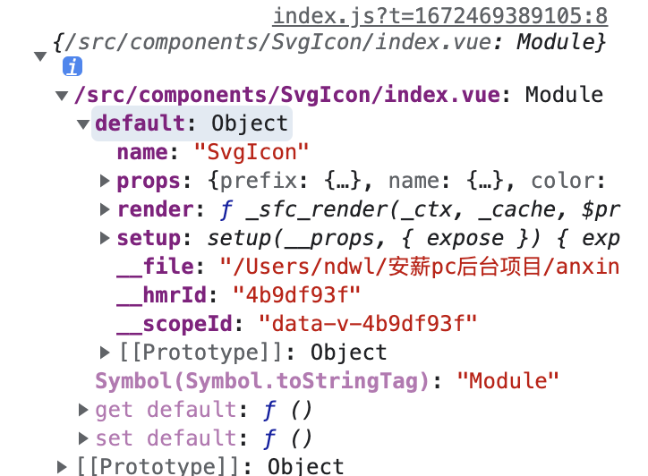

# 基于 vue3+vite+pina+element-plus 相关系统搭建过程

> 参考`有来技术团队` [vue3-element-admin](https://www.youlai.tech/pages/5d571c/#%E9%A1%B9%E7%9B%AE%E7%AE%80%E4%BB%8B) 自己跟着搭建了一遍

> vue3.3 特性了解：https://juejin.cn/post/7231940493256032316#heading-21

> `defineOptions`不用再引入插件写 name 啦

> `defineModel` 简化 双向绑定的 prop

## 1. 项目初始化

> [Vite 官方中文文档](https://cn.vitejs.dev/guide/#scaffolding-your-first-vite-project)：https://cn.vitejs.dev/guide/

- **初始化项目**

```js
pnpm create vite my-vue-app --template vue
```

- my-vue-app：项目名称
- vue: Vue 的模板，除此还有 vue-ts(Vue + TypeScript 的模板) ，react，react-ts 模板等

* **启动项目**

```js
cd my-vue-app
pnpm install
pnpm run dev
```

## 2. 自动按需导入 element-plus

- **安装 element-plus**

```js
pnpm install element-plus
```

- **按需导入-自动导入**

首先你需要安装 unplugin-vue-components 和 unplugin-auto-import 这两款插件

```js
pnpm install -D unplugin-vue-components unplugin-auto-import
```

- **`vite.config.js`配置**

```js
// vite.config.js
import { defineConfig } from "vite";
import vue from '@vitejs/plugin-vue'

// element-plus 按需导入-自动导入
import AutoImport from "unplugin-auto-import/vite";
import Components from "unplugin-vue-components/vite";
import { ElementPlusResolver } from "unplugin-vue-components/resolvers";

export default defineConfig({
  // ...
  plugins: [
    vue()
    // element-plus 按需导入-自动导入
    AutoImport({
      resolvers: [ElementPlusResolver()],
    }),
    Components({
      resolvers: [ElementPlusResolver()],
    }),
  ],
});
```

## 3. 路径别名配置

> 使用 @ 代替 src

- **Vite 配置**

```js
// vite.config.ts
import { defineConfig } from "vite";
import vue from "@vitejs/plugin-vue";
import path from "path";

export default defineConfig({
  plugins: [vue()],
  resolve: {
    alias: {
      "@": path.resolve("./src"), // 相对路径别名配置，使用 @ 代替 src
    },
  },
});
```

- **`@/`后的提示**

> ts 的话，写 `tsconfig.ts`

```js
// jsconfig.json
{
  "compilerOptions": {
    "baseUrl": "./", // 解析非相对模块的基地址，默认是当前目录
    "paths": {
      //路径映射，相对于baseUrl
      "@/*": ["src/*"]
    }
  },
  "include": [
    "src/**/*.js",
    "src/**/**/*.js",
    "src/**/*.vue",
    "src/views/**/**/type"
  ],
  "exclude": ["node_modules", "app", "dist", "script", "esbuild.config.js"]
}

```

## 4. 环境变量

- **注意事项：**

> 官方教程: https://cn.vitejs.dev/guide/env-and-mode.html

> 为了防止意外地将一些环境变量泄漏到客户端，只有以 `VITE_`为前缀的变量才会暴露给经过 vite 处理的代码。

> `.env.\*.local` 文件应是本地的，可以包含敏感变量。你应该将 .local 添加到你的 .gitignore 中，以避免它们被 git 检入。

```js
.env                # 所有情况下都会加载
.env.local          # 所有情况下都会加载，但会被 git 忽略
.env.[mode]         # 只在指定模式下加载
.env.[mode].local   # 只在指定模式下加载，但会被 git 忽略
```

- **模式：** 默认情况下，开发服务器 (dev 命令) 运行在 development (开发) 模式，而 build 命令则运行在 production (生产) 模式。

> 在你想将 开发、测试、正式环境区分时，若想在 vite build 时运行不同的模式来渲染不同的标题，你需要在传递 `--mode` 选项标志来覆盖命令使用的默认模式。
> 你需要创建三个 `.env.[mode]`文件，并且需要修改 `package.json`命令，就像下面这样，

```json
// package.json
"scripts": {
    "dev": "vite",
    "build": "vite build",
    "test": "vite build --mode test", // 这里需要 选项标志 --mode 来覆盖命令使用的默认模式
    "preview": "vite preview --mode test"
  },
```

- 开发环境配置：.env.development

```js
# 变量必须以 VITE_ 为前缀才能暴露给外部读取
VITE_NODE_ENV='development'
VITE_APP_TITLE = 'my-vue-app'
VITE_APP_PORT = 3000
VITE_APP_BASE_API = '/dev-api'
```

- 生产环境配置：.env.test(测试)

```js
# 生产环境(测试）
# 变量必须以 VITE_ 为前缀才能暴露给外部读取
VITE_NODE_ENV='test'
VITE_APP_TITLE = 'PC后台'
VITE_APP_PORT = 3000
VITE_APP_BASE_URL = '/api'
```

- 生产环境配置：.env.production(正式)

```js
# 生产环境(正式）
# 变量必须以 VITE_ 为前缀才能暴露给外部读取
VITE_NODE_ENV='production'
VITE_APP_TITLE = 'PC后台'
VITE_APP_PORT = 8080
VITE_APP_BASE_URL = '/prod-api'
```

## 5. 获取配置的环境变量

- **在`.vue`文件中获取**

```js
console.log(import.meta.env);
console.log(import.meta.env.VITE_APP_BASE_URL);
```

- **在`vite.config.js`中获取**：https://cn.vitejs.dev/config/#environment-variables

> 1. 默认情况下，开发服务器 (`dev` 命令) 运行在 `development` (开发) 模式，而 `build` 命令则运行在 `production` (生产) 模式。**`mode`获取当前运行在那个模式**

> 2. 你可以使用 Vite 导出的 `loadEnv` 函数来加载指定的 .env 文件。

> 3. `process.cwd()`：项目根目录（index.html 文件所在的位置）。可以是一个绝对路径，或者一个相对于该配置文件本身的相对路径。

```js{5,8}
//  vite.config.js
import { defineConfig, loadEnv } from "vite";
import vue from "@vitejs/plugin-vue";

export default ({command, mode }) => {
   // 根据当前工作目录中的 `mode` 加载 .env 文件
   // 设置第三个参数为 '' 来加载所有环境变量，而不管是否有 `VITE_` 前缀。
  const env = loadEnv(mode, process.cwd());
  return defineConfig({
    plugins: [vue()],
    // 本地反向代理解决浏览器跨域限制
    server: {
      // hmr: true,
      host: 'localhost',
      port: Number(env.VITE_APP_PORT), // 启动后配置的端口号
      open: true, // 启动后是否自动打开浏览器
      proxy: {
        [env.VITE_APP_BASE_URL]: {
          target: '项目地址', // 自己项目地址
          ws: true,
          changeOrigin: true, // 开启跨越
          // 以 ^ 开头，将被识别为 RegExp。
          // 这样写的话需要针对不同环境配置这个请求变量，并且需要注意前面这个 ^ 要进行 \ 转义
          rewrite: (path) => path.replace(/^\/api/, '/')
          // rewrite: (path) =>
          //   path.replace(new RegExp('^' + env.VITE_APP_BASE_URL), '')
        }
      }
    },
  });
};
```

## 6. SVG 图标

> 官方教程： https://github.com/vbenjs/vite-plugin-svg-icons/blob/main/README.zh_CN.md

- **安装 vite-plugin-svg-icons**

```js
pnpm install vite-plugin-svg-icons -D
```

- **在项目 `src/assets/icons` 文件夹下，存放 iconfont 下载的 SVG 图标**

* **`vite.config.js` 中配置插件**

```js
// vite.config.ts
import { defineConfig, loadEnv } from "vite";
import vue from "@vitejs/plugin-vue";
import { createSvgIconsPlugin } from "vite-plugin-svg-icons";

export default defineConfig(({ command, mode }) => {
  // 获取 .env 环境配置文件
  const env = loadEnv(mode, process.cwd(), "");
  return {
    plugins: [
      vue(),
      createSvgIconsPlugin({
        // 指定需要缓存的图标文件夹
        iconDirs: [path.resolve(process.cwd(), "src/assets/icons")],
        // 指定symbolId格式
        symbolId: "icon-[dir]-[name]",
      }),
    ],
  };
});
```

- **main.js 引入注册脚本**

```js
// main.js
import "virtual:svg-icons-register";
```

- **组件封装**

```vue
<!-- src/components/SvgIcon/index.vue -->
<template>
  <svg aria-hidden="true" class="svg-icon">
    <use :xlink:href="symbolId" :fill="color" />
  </svg>
</template>

<script setup name="SvgIcon">
import { computed } from "vue";
const props = defineProps({
  prefix: {
    type: String,
    default: "icon",
  },
  name: {
    type: String,
    required: true,
  },
  color: {
    type: String,
    default: "",
  },
});

const symbolId = computed(() => `#${props.prefix}-${props.name}`);
</script>

<style scoped>
.svg-icon {
  width: 1.5em;
  height: 1.5em;
  vertical-align: -0.15em;
  overflow: hidden;
  fill: currentColor;
}
</style>
```

- **使用**
  > 使用的 `name` 需在文件夹 `src/assets/icons` 下存放

```vue
<template>
  <svg-icon name="menu" />
</template>

<script setup lang="ts">
import SvgIcon from "@/components/SvgIcon/index.vue";
</script>
```

## 7. setup 下 name 的处理

- **安装` vite-plugin-vue-setup-extend`**

```js
pnpm i vite-plugin-vue-setup-extend -D
```

- **`vite.config.js`注册**

```js
// vite.config.js
import { defineConfig, loadEnv } from "vite";
import vue from "@vitejs/plugin-vue";
import VueSetupExtend from "vite-plugin-vue-setup-extend";
export default ({ mode }) => {
  return defineConfig({
    plugins: [
      vue(),
      // name组件的注册
      VueSetupExtend(),
    ],
  });
};
```

## 8. 公用组件的全局注册

::: info import.meta.glob

1. `import.meta.glob('@/components/**/index.vue', {
  eager: true,
  import:'default'
})`解析文件夹`@/components/**/index.vue`下所有的 index.vue 文件

2. 设置 `import` 为 `default` 可以加载默认导出。加入后可以不使用 `.default.name`这样获取

   :::
   

- **主要实现代码**

```js
// src/components/index.js
// 获取所有组件信息
// eager: true 可以对这些模块进行 tree-shaking。
const allRoutes = import.meta.glob("@/components/**/index.vue", {
  eager: true,
});
export default {
  // 以插件形式注册
  install(app) {
    for (let key in allRoutes) {
      app.component(allRoutes[key].default.name, allRoutes[key].default);
    }
  },
};
```

- **在组件内的`script`标签上写 `name='组件名称'`**

```vue{3}
// src/components/组件名称/index.vue
<template></template>
<script setup name="组件名称"></script>
<style scoped></style>
```

- **`main.js`下注册**

```js
import { createApp } from "vue";
import "./style.css";
import App from "./App.vue";
// svg图标注册脚本
import "virtual:svg-icons-register";

// 公用组件注册
import globalComponents from "@/components";
const app = createApp(App);
app.mount("#app");
app.use(globalComponents);
```

## 9. [Pinia 状态管理](https://pinia.vuejs.org/zh/introduction.html)

> Pinia 是 Vue.js 的轻量级状态管理库，Vuex 的替代方案

- **安装 pinia**

```js
pnpm install pinia
```

- **Pinia 全局注册**

```js
// src/main.ts
import { createApp } from "vue";
import "./style.css";
import App from "./App.vue";
// pinia的全局注册
import { createPinia } from "pinia";
const app = createApp(App);

app.use(globalComponents);
app.use(createPinia());
app.mount("#app");
```

- **Pinia 模块封装**

```js
// src/store/modules/user.js
// 用户状态模块  类似于 vuex 的写法，还有一种 setup 写法
import { defineStore } from "pinia";
const useUserStore = defineStore({
    id: "user", // 第一个参数是你的应用中 Store 的唯一 ID。
    state: () => ({
        token:'',
        nickname: '',
        count: 0,
    }),
    actions: {
      getUserInfo() {
      	return new Promise(((resolve, reject) => {
          ...
          resolve(data)
          ...
        }))
      },
    increment() {
      this.count++
    },
    }
})
export default useUserStore;

// src/store/index.js
import useUserStore from './modules/user'
const useStore = () => ({
    user: useUserStore()
})
export default useStore
```

- **使用 pinia**

```js
import useStore from "@/store";

const { user } = useStore();
// state
const token = user.token;
const count = user.count;
// action
user.getUserInfo().then(({ data }) => {
  console.log(data);
});
user.increment();
```

## 10. [路由的注册](https://router.vuejs.org/zh/guide/#javascript)

::: details 路由的注册
**一、常规注册就一个个写路由文件，不多说**

**二、动态注册** 创建这样一个路由对象

```js
// 路由文件一般都这样
const routerName = {
  path: "/path",
  name: "pathname",
  component: () => import("@/views/..../index.vue"),
  meta: {
    title: "反馈管理",
    icon: "icon-fankui",
    hidden: true,
  },
};
```

1. 学习小程序页面配置写一个 js 文件，像这样

```js
// pgae.js
const pageConfig = {
  title: "反馈管理",
  icon: "icon-fankui",
  hidden: true,
};
export default pageConfig;
```

2. 可以通过 `import.meta.glob('@/views/**/**/**.js',{ eager: true, import:'default'})`，获取到文件内容，这里得到的就是路由元信息 `mata`，
3. 上一步的到的是一个数组对象，对象类似于`{"导入的文件地址：文件内容"}`，路由的 `path` 和 `name` 可以通过文件地址名称设置，现在少的就是路由的`component`啦，
4. `component`中的路由信息可以通过 `import.meta.glob('@/views/**/**/index.vue',)`来获取，`{ eager: true }`，加上获取的是 `model`内容，不加的话就是动态导入，现在一个路由对象就完成啦。
   :::

::: details 路由文件（/router/index.js)

**注意事项**

> 1.  使用`pinia`需要在路由注册后，不然无法实例化
> 2.  在路由的前置守卫(`router.befroEach()`)中，**需要正确的条件判断添加动态路由，防止进入死循环**

```js
import { createRouter, createWebHashHistory } from "vue-router";
import useStore from "@/store";
import { localStorage } from "@/utils/storage";

// 白名单
const whiteList = ["/login", "/404"];
// 路由信息
const constantRoutes = [
  {
    path: "/login",
    name: "login",
    component: () => import("@/views/login/index.vue"),
    meta: {
      title: "登录页面",
    },
  },
  {
    path: "/:pathMatch(.*)*",
    name: "NotFound",
    component: () => import("@/views/errorPage/notFound.vue"),
  },
];

// 创建路由实例
const router = createRouter({
  history: createWebHashHistory(),
  routes: constantRoutes,
  // 始终滚动到顶部
  scrollBehavior(to, from, savedPosition) {
    if (savedPosition) {
      return savedPosition;
    } else {
      return { top: 0 };
    }
  },
});

// 前置守卫
router.beforeEach((to, from) => {
  const { routesStore } = useStore();
  const token = localStorage.get("ANXINPC_TOKEN");

  // 有token
  if (token) {
    if (to.path === "/login") {
      return from.fullPath;
    } else {
      // 需要条件判断是否在刷新时注册路由 防止进入死循环
      if (routesStore.dynamicsRouters.length === 0) {
        // 在 routesStore 中动态添加路由
        routesStore.generateRoutes();
        //  触发重定向
        return to.fullPath;
      } else {
        return true;
      }
    }
  } else {
    routesStore.dynamicsRouters = [];
    // 无token 去白名单
    if (whiteList.includes(to.path)) {
      return true;
    } else {
      return "/login";
    }
  }
});
// 后置守卫
router.afterEach((to, form) => {
  // 实例化pinia对象必须在这里，不然在路由注册时pinia没有完成实例化
  const { routesStore } = useStore();
  // to.matched 与给定路由地址匹配的标准化的路由记录数组。
  const matchedRouters = to.matched;
  // 面包屑
  routesStore.setBreadcrumbList(matchedRouters);
});

export default router;
```

:::

::: details 路由中要使用的方法

```js
import { deepClone } from "@/utils/tool";

const Layout = () => import("@/layout/index.vue");

// 公共路由
const layoutRouter = {
  path: "/layout",
  name: "layout",
  component: Layout,
  meta: {
    title: "首页",
    icon: "cs1",
    hidden: true,
  },
  children: [],
};

/**
 * @description: 侧边栏单个的话加入到公共路由中
 * @param {Array} dynamicRouter ===> 动态路由信息
 * @Author: zhs
 */
export const toPublicRouter = (dynamicRouter = []) => {
  const routers = deepClone(dynamicRouter);
  routers.map((obj, index) => {
    if (!(obj.children && obj.children.length > 0)) {
      // 添加路由
      layoutRouter.children.push(obj);
    }
  });
  return layoutRouter;
};

/**
 * @description: 只返回该角色有的路由信息
 * @param {*} routers :所有的路由信息数组
 * @param {*} permissionRoutingMarking :路由权限标识
 * @Author: zhs
 */
export const getRoleRouters = (routers, permissionRoutingMarking = []) => {
  if (routers.children && routers.children.length <= 0) return;
  if (permissionRoutingMarking.length <= 0) return routers;

  return routers.filter((obj) => {
    if (obj.children) {
      obj.children = getRoleRouters(obj.children, permissionRoutingMarking);
    }
    // 筛选出权限路由
    if (permissionRoutingMarking.includes(obj.path)) {
      // 并将 hidden 设置为true
      obj.meta.hidden = true;
      return true;
    }
  });
};

/**
 * @description: // 通过  import.meta.glob 自动导入，但是顺序为遍历的顺序，其实就是文件夹下的 js文件 的顺序
 *               // 可以在 路由对象中加一个排序字段 遍历时进行排序
 * @param {object}  importRoutersObj  导入的文件对象信息
 * @Author: zhs
 */
export const botchImportRouters = (importRoutersObj) => {
  const componeyRouter = [];
  for (let key in importRoutersObj) {
    componeyRouter.push(importRoutersObj[key].default);
  }
  return componeyRouter;
};

export default { toPublicRouter, recursionRouter, botchImportRouters };
```

:::

::: details `store`中的动态添加路由和重定向路由信息

```js
import { defineStore } from "pinia";
import router from "@/router";
import usestore from "../index";
import {
  permissionDynamicRouter,
  allDynamicRouter,
} from "@/router/dynamicRouter";
import { recursionRouter, getRoleRouters } from "@/router/routerUtils";
import { deepClone } from "@/utils/tool";
import { localStorage } from "@/utils/storage";

const useRoutesStore = defineStore({
  id: "routesStore",
  state: () => ({
    breadcrumbList: [], // 面包屑信息
    dynamicsRouters: [], // 动态路由信息
    firstPage: "",
  }),

  actions: {
    // 设置面包屑信息
    setBreadcrumbList(list) {
      this.breadcrumbList = list;
    },
    // 设置动态路由
    generateRoutes() {
      // localStorage 数据
      const accountInfo = localStorage.get("ACCOUNT_INFO");
      const permissionRoutingMarking = localStorage.get("PERMISSION_ROUTER");
      const { userStore } = usestore(); // 拿到 userStore 中的数据
      // 获取权限 id
      const roleId = userStore.accountInfo?.role_id || accountInfo?.role_id;
      // 权限标识
      const roleMarks =
        userStore.permissionRoutingMarking.length > 0
          ? userStore.permissionRoutingMarking
          : permissionRoutingMarking;
      // 因为单个的路由信息添加进  /layout 中，标识中没有，这里添加一下
      roleMarks.push("/layout");
      // 判断动态路由  //0超管1人资2运营3人资+运营
      this.dynamicsRouters =
        roleId === 0
          ? deepClone(allDynamicRouter)
          : getRoleRouters(deepClone(permissionDynamicRouter), roleMarks);
      this.filterFirstPage();
      // 动态添加路由
      this.dynamicsRouters.forEach((obj) => {
        router.addRoute(obj);
      });
      // 添加重定向路由
      router.addRoute({
        path: "/",
        name: "redirectPage",
        redirect: this.firstPage,
      });
    },
    filterFirstPage() {
      // 权限路由第一个路由是否有children
      const isChildren =
        this.dynamicsRouters[0].children &&
        this.dynamicsRouters[0].children.length > 0;
      if (isChildren) {
        this.firstPage = this.dynamicsRouters[0].children[0].path;
      } else {
        this.firstPage = this.dynamicsRouters[0].path;
      }
    },
  },
});

export default useRoutesStore;
```

:::

## 11. Axios 网络请求库封装

```js
import axios from "axios";
import { localStorage } from "@/utils/storage";
import { ElMessage, ElLoading } from "element-plus";
import router from "@/router";

// loading实例
let loadingInstance = null;

// 默认 自定义的config
const baseConfig = {
  loading: false,
  // 是否自动提示错误信息，控制台会警告，没有处理错误（没有try catch)
  autoError: true,
  loadingText: "正在请求中...",
};

// 创建实例
const service = axios.create({
  baseURL: import.meta.env.VITE_APP_BASE_URL,
  timeout: 6000,
  headers: { "Content-Type": "application/json;charset=utf-8" },
  ...baseConfig, // 默认请求配置 放在这里
});

// 请求拦截器
service.interceptors.request.use(
  (config) => {
    if (config.loading) {
      loadingInstance = ElLoading.service({ text: config.loadingText });
    } else {
      loadingInstance?.close();
    }
    // 注入token
    const token = localStorage.get("ANXINPC_TOKEN");
    if (token) {
      config.headers["X-Api-Key"] = `${token}`;
    }

    return config;
  },
  (err) => {
    // console.log(err,'request---err')
    loadingInstance?.close();
    ElMessage.error(err.message);
    return Promise.reject(err); // 请求错误让请求走到catch而不是then
  }
);

// 响应拦截器
service.interceptors.response.use(
  (res) => {
    loadingInstance?.close();
    // 响应数据为二进制流处理(Excel导出)
    if (res.data instanceof ArrayBuffer) {
      return res.data;
    } else if (res.data.code === 200) {
      return res.data.data;
    } else if (res.data.code === 401) {
      localStorage.remove("ANXINPC_TOKEN");
      return router.push({
        path: "/login",
      });
    } else {
      let message = res && res.data && res.data.message;
      if (message instanceof Object) {
        for (let k in message) {
          res.config.autoError && ElMessage.error(message[k]);
          return Promise.reject(res.data);
        }
      } else {
        res.config.autoError && ElMessage.error(message);
        return Promise.reject(res.data);
      }
      // return res.data
      // 响应的 code !== 200 就reject
      return Promise.reject(res.data);
    }
  },
  (err) => {
    loadingInstance?.close();
    // 请求超时单独判断，因为请求超时没有 response
    if (err.message.indexOf("timeout") !== -1)
      return ElMessage.error("请求超时！请您稍后重试");
    // 根据响应的错误状态码，做不同的处理
    if (err && err.response) {
      switch (err.response.status) {
        case 400:
          err.message = err.response.data;
          break;
        case 401:
          err.message = "授权失败，请重新登录";
          break;
        case 403:
          err.message = "拒绝访问";
          break;
        case 404:
          err.message = "请求错误未找到该资源";
          break;
        case 500:
          err.message = "服务端出错";
          break;
      }
    } else {
      err.message = "连接服务器出错";
    }
    // 微信登录失败
    window.location.href = window.location.href.split("?")[0];
    ElMessage.error(err.message);
    // console.log(err, '响应拦截器err')
    return Promise.reject(err && err.response); // 请求错误让请求走到catch而不是then
  }
);
//  常用请求方法封装
const http = {};
http.get = (url, params, config) => {
  // 请求的配置需要和 params 同级
  // { params, ...config } ===> 等同于 { params:params, ...config }
  return service.get(url, { params, ...config });
};

http.post = (url, data, config) => {
  // config 请求的配置，直接传第三个
  return service.post(url, data, config);
};

http.put = (url, data, config) => {
  return service.put(url, data, config);
};
http.delete = (url, data, config) => {
  return service.delete(url, { params: data, ...config });
};

/**
 * @description: 导出excel 转为二进制转出
 * @param {String} url 请求地址
 * @param {ArrayBuffer} data 二进制请求参数（设置  responseType: 'arraybuffer' 或者  responseType: 'blob'），如设置为 bolb 的话就需要将上面响应拦截器 变为二进制为 Blob 不然会走 catch
 * @param {Object} config 请求头配置和剩余参数
 * @Author: zhs
 */
http.export = (url, data, config) => {
  const configOptions = {
    responseType: "arraybuffer",
    ...config,
  };
  return service.post(url, data, configOptions);
};

// 上传excel
http.postFile = (url, data, config) => {
  const configOptions = {
    headers: {
      "Content-Type": "multipart/form-data",
    },
    ...config,
  };
  return service.post(url, data, configOptions);
};
export default http;

// export default service
```

- **上传图片**

```js
import request from "./index";

// 图片上传地址
export const uploadFileImg = (file) => {
  const formData = new FormData();
  formData.append("image", file); // 像 formData 里面添加 字段 image 值为 file 下同
  formData.append("category", "school_image"); // 因为公司oss必须要上传文件类型
  // console.log(formData)
  return request({
    url: "https://zyjy-dev.51jshl.com/api/admin/common/upload",
    method: "POST",
    data: formData,
    headers: {
      "Content-Type": "multipart/form-data",
    },
  });
};
```

## 12. `vite.config.js` 配置

```js
import { defineConfig, loadEnv } from "vite";
import vue from "@vitejs/plugin-vue";
import path from "path";

// element-plus 按需导入-自动导入
import AutoImport from "unplugin-auto-import/vite";
import Components from "unplugin-vue-components/vite";
import { ElementPlusResolver } from "unplugin-vue-components/resolvers";

// svg图标
import { createSvgIconsPlugin } from "vite-plugin-svg-icons";
// setup下name书写
import VueSetupExtend from "vite-plugin-vue-setup-extend";
// 在模块的最高层中使用 await 操作符
import TopLevelAwait from "vite-plugin-top-level-await";

export default ({ mode, command }) => {
  const env = loadEnv(mode, process.cwd());
  return defineConfig({
    assetsInclude: ["**/*.xlsx"],
    base: "./",
    plugins: [
      vue(),
      // name组件的注册
      VueSetupExtend(),
      // element-plus 按需导入-自动导入
      AutoImport({
        resolvers: [ElementPlusResolver()],
      }),
      Components({
        resolvers: [ElementPlusResolver()],
      }),
      // svg图标
      createSvgIconsPlugin({
        // 指定需要缓存的图标文件夹
        iconDirs: [path.resolve(process.cwd(), "src/assets/icons")],
        // 指定symbolId格式
        symbolId: "icon-[dir]-[name]",
      }),
      // 在模块的最高层中使用 await 操作符
      TopLevelAwait({
        // The export name of top-level await promise for each chunk module
        promiseExportName: "__tla",
        // The function to generate import names of top-level await promise in each chunk module
        promiseImportName: (i) => `__tla_${i}`,
      }),
    ],
    // 本地反向代理解决浏览器跨域限制
    server: {
      hmr: true,
      host: "localhost",
      port: Number(env.VITE_APP_PORT), // 开启端口号
      open: true, // 启动后是否自动打开浏览器
      proxy: {
        [env.VITE_APP_BASE_URL]: {
          target: "https://ax-dev.lhygb.com/api", // 自己项目地址
          ws: true,
          changeOrigin: true, // 开启跨越
          // 以 ^ 开头，将被识别为 RegExp。
          // 这样写的话需要针对不同环境配置这个请求变量，并且需要注意前面这个 ^ 要进行 \ 转义
          rewrite: (path) => path.replace(/^\/api/, "/"),
          // rewrite: (path) =>
          //   path.replace(new RegExp('^' + env.VITE_APP_BASE_URL), '')
        },
      },
    },
    build: {
      sourcemap: false, // 是否输出.map文件
      // 指定生成静态资源的存放路径 (相对于 build.outDir)
      assetsDir: "platform",
      rollupOptions: {
        output: {
          chunkFileNames: "platform/js/[name]-[hash].js",
          entryFileNames: "platform/js/[name]-[hash].js",
          assetFileNames: "platform/[ext]/name-[hash].[ext]",
        },
        // output: {
        //   manualChunks: (id) => {
        //     if (id.indexOf('node_modules') > -1) {
        //       return 'vendor'
        //     }
        //   }
        // }
      },
    },
    resolve: {
      alias: {
        "@": path.resolve("./src"), // 相对路径别名配置，使用 @ 代替 src
        "~/": `${path.resolve(__dirname, "src")}/`,
      },
    },
  });
};
```
