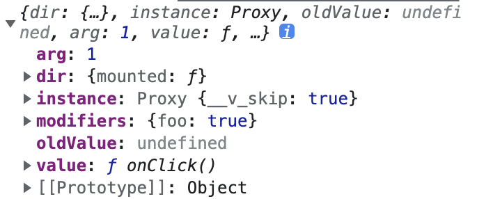

# vue 常见技巧

## 1. css 属性选择器示例

> 页面上 “属性选择器”这几个字显示红色

```js
// 页面上 “属性选择器”这几个字显示红色
 <div data-v-hash class="test-attr">属性选择器</div>
  <style>
    /* 该标签有个data-v-hash的属性，只不过该属性为空，依然可以使用属性选择器 */
   .test-attr[data-v-hash] {
    color: red;
  }
  </style>
  <script>
     // 通过js判断是否存在 data-v-hash 属性
     console.log(document.querySelector('.test-attr').getAttribute('data-v-hash') === ''); // true
  </script>
```

## 2. [CSS 中的 v-bind()](https://cn.vuejs.org/api/sfc-css-features.html#v-bind-in-css)

```vue
<script setup>
import { ref } from "vue";
const theme = ref("red");
const colors = ["blue", "yellow", "red", "green"];
setInterval(() => {
  theme.value = colors[Math.floor(Math.random() * 4)];
}, 1000);
</script>
<template>
  <p>hello</p>
</template>
<style scoped>
/* Modify the code to bind the dynamic color */
p {
  color: v-bind("theme");
}
</style>
```

## 3. [自定义指令](https://cn.vuejs.org/guide/reusability/custom-directives.html#directive-hooks)

**`v-focus` 自动聚焦**

::: tip v-focus

> `el-input`的话需要绑定到 `input` 本身上，使用 `el.querySelector("input")`

```vue
<template>
  <input v-focus />
</template>

<script setup>
const vFocus = {
  mounted: (el) => {
    console.log(el);
    el.querySelector("input").focus();
    // el.focus()
  },
};
</script>
```

:::

**`v-debounce` 点击防抖**

::: details 指令的钩子参数

> `el: ` 指令绑定到的元素。这可以用于直接操作 DOM。

> `binding`：一个对象，包含以下属性。

- `value`：传递给指令的值。例如在 v-my-directive="1 + 1" 中，值是 2。
- `oldValue`：之前的值，仅在 beforeUpdate 和 updated 中可用。无论值是否更改，它都可用。
- `arg`：传递给指令的参数 (如果有的话)。例如在 v-my-directive:foo 中，参数是 "foo"。
- `modifiers`：一个包含修饰符的对象 (如果有的话)。例如在 v-my-directive.foo.bar 中，修饰符对象是 { foo: true, bar: true }。
- `instance`：使用该指令的组件实例。
- `dir`：指令的定义对象。

> `vnode`：代表绑定元素的底层 VNode。

> `prevNode`：之前的渲染中代表指令所绑定元素的 VNode。仅在 beforeUpdate 和 updated 钩子中可用。

:::

通过下方的指令的 `binding`图片可以看到，在本例中，

> `arg`： 传递给指令的参数，这里为动态指定的 `demo` 参数，值为 1

> `modifiers`： 修饰符的对象，为`{foo:true}`

> `value`：在这里为一个函数，即 `onClick`

> 

::: tip v-debounce

```vue
<template>
  <el-button v-debounce:[demo].foo="onClick">点击</el-button>
</template>

<script setup>
import { ref } from "vue";
const demo = ref(1);

// 点击事件
function onClick() {
  // console.log(demo.value)
  console.log("Only triggered once when clicked many times quickly");
}

// 防抖
const debounce = (fn, wait = 1000) => {
  let timer = null;
  return function (...args) {
    // 每次进来都会清空定时器，所以在 wait 事件中重复执行之后执行最后一次
    clearInterval(timer);
    timer = setTimeout(fn, wait);
  };
};

// 防抖指令
const vDebounce = {
  mounted(el, binding) {
    // console.log(binding)
    // 注册点击事件，传入 binding.value => onClick，和延时时间 binding.arg
    el.addEventListener("click", debounce(binding.value, binding.arg));
  },
};
</script>
```

:::

**`v-throttle`** 节流
::: tip v-throttle 节流

```vue
<template>
  <el-button v-debounce-click:200="onClick">好吃的我就是快点回家</el-button>
</template>

<script>
// 点击事件
function onClick() {
  console.log("Only triggered once when clicked many times quickly");
}

// 节流
const throttle = (fn, wait = 1000) => {
  let timer = null;
  return function (...args) {
    clearTimeout(timer);
    timer = setTimeout(() => {
      fn();
      clearTimeout(timer);
    }, wait);
  };
};

// 节流指令
const vDebounceClick = {
  mounted(el, binding) {
    console.log(binding);
    el.addEventListener("click", throttle(binding.value, binding.arg));
  },
};
</script>
```

:::

## 4. 动态路由树结构数据，遍历得到想要的结果

**第一种：改变 hidden，并且将不需要的转换为 404，防止地址栏找到（不推荐）**
这样，所有的路由信息都会在里面，只不过没有权限的路由 path 变为 '/404'

```js
/**
 * @description: 根据设置的权限路由标识来筛选出权限角色的路由
 * @param {Array} routers :所有的路由信息数组
 * @param {Arrray} permissionRoutingMarking :路由权限标识 需要添加 '/layout'
 * @return 改变hidden或者修改path达到效果
 * @Author: zhs
 */
export const recursionRouter = (routers, permissionRoutingMarking = []) => {
  if (routers.children && routers.children.length <= 0) return;
  if (permissionRoutingMarking.length <= 0) return routers;
  const resultRouter = routers.map((obj, index) => {
    // 在 权限路由标识 数组中找不到的话就将其隐藏
    if (!permissionRoutingMarking.includes(obj.path)) {
      obj.meta.hidden = false;
      // 通过地址栏找不到该页面，不需要注释掉就行
      if (obj.path !== "/layout") obj.path = "/404";
    } else {
      obj.meta.hidden = true;
    }
    // 有 chilren 就会递归遍历里面的数据
    obj.children && recursionRouter(obj.children, permissionRoutingMarking);
    return obj;
  });
  return resultRouter;
};
```

**第二种：直接过滤出符合角色权限的路由数据（推荐）**

```js
/**
 * @description: 返回角色权限路由
 * @param {*} routers :所有的路由信息数组
 * @param {*} permissionRoutingMarking :路由权限标识 需要添加 '/layout'
 * @return 只返回该角色有的路由信息
 * @Author: zhs
 */
export const getRoleRouters = (routers, permissionRoutingMarking = []) => {
  if (routers.children && routers.children.length <= 0) return;
  if (permissionRoutingMarking.length <= 0) return routers;

  return routers.filter((obj) => {
    // 将由children的数据递归处理，找到有该权限的数据，并重新赋值给 obj.children
    if (obj.children) {
      obj.children = getRoleRouters(obj.children, permissionRoutingMarking);
    }
    // 筛选出该权限路由（这里是在权限标识中找到当前的 obj.path）
    if (permissionRoutingMarking.includes(obj.path)) {
      // 防止本地路由设置为false后，侧边栏不现实，将 hidden 设置为true
      obj.meta.hidden = true;
      return true;
    }
  });
};
```
