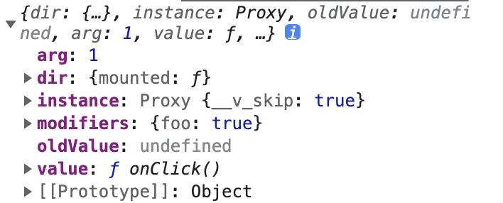

# vue [常见指令](https://cn.vuejs.org/guide/reusability/custom-directives.html#introduction)

<script setup>
  import DebounceDir from './directive/debounceDir.vue'
</script>

## 一、注册自定义指令

### 1. 在 `<script setup>` 中，**任何以 v 开头的驼峰式命名的变量都可以被用作一个自定义指令**。`vFocus `即可以在模板中以 `v-focus` 的形式使用。

::: details 在 `<script setup>` 中

```vue
<script setup>
// 在模板中启用 v-focus
const vFocus = {
  mounted: (el) => el.focus(),
};
</script>
<template>
  <input v-focus />
</template>
```

:::

### 2. 在没有使用 `<script setup>` 的情况下，自定义指令需要通过 `directives` 选项注册：

:::details 没有`<script setup>`

```js
export default {
  setup() {
    /*...*/
  },
  directives: {
    // 在模板中启用 v-focus
    focus: {
      /* ... */
    },
  },
};
```

:::

### 3. 将一个自定义指令全局注册到应用层级

:::details 全局注册

```js
const app = createApp({})

// 使 v-focus 在所有组件中都可用
app.directive('focus', {
/_ ... _/
})
```

:::

### 4. 简化形式（在`mounted` 和 `updated` 上实现相同的行为，这种情况下我们可以直接用一个函数来定义指令）

:::details

```js
<div v-color="color"></div>;
app.directive("color", (el, binding) => {
  // 这会在 `mounted` 和 `updated` 时都调用
  el.style.color = binding.value;
});
```

:::

## 二、指令钩子（vue2 和 vue3 不一样，这是 vue3 的）

:::details 指令钩子

```js
onst myDirective = {
  // 在绑定元素的 attribute 前
  // 或事件监听器应用前调用
  created(el, binding, vnode, prevVnode) {
    // 下面会介绍各个参数的细节
  },
  // 在元素被插入到 DOM 前调用
  beforeMount(el, binding, vnode, prevVnode) {},
  // 在绑定元素的父组件
  // 及他自己的所有子节点都挂载完成后调用
  mounted(el, binding, vnode, prevVnode) {},
  // 绑定元素的父组件更新前调用
  beforeUpdate(el, binding, vnode, prevVnode) {},
  // 在绑定元素的父组件
  // 及他自己的所有子节点都更新后调用
  updated(el, binding, vnode, prevVnode) {},
  // 绑定元素的父组件卸载前调用
  beforeUnmount(el, binding, vnode, prevVnode) {},
  // 绑定元素的父组件卸载后调用
  unmounted(el, binding, vnode, prevVnode) {}
}
```

:::

::: details 指令的钩子参数

#### 1. el: 指令绑定到的元素。这可以用于直接操作 DOM。

#### 2. binding：一个对象，包含以下属性。

- `value`：**传递给指令的值。例如在 `v-my-directive="1 + 1"` 中，值是 2。**
- `oldValue`：之前的值，仅在 beforeUpdate 和 updated 中可用。无论值是否更改，它都可用。
- `arg`：**传递给指令的参数 (如果有的话)。例如在 `v-my-directive:foo`中，参数是 "foo"。**
- `modifiers`：**一个包含修饰符的对象 (如果有的话)。例如在 `v-my-directive.foo.bar` 中，修饰符对象是 { foo: true, bar: true }。**
- `instance`：使用该指令的组件实例。
- `dir`：指令的定义对象。

> `vnode`：代表绑定元素的底层 VNode。

> `prevNode`：之前的渲染中代表指令所绑定元素的 VNode。仅在 beforeUpdate 和 updated 钩子中可用。

:::

举例来说

```js
<div v-example:demo.foo="onClick">

  {
  arg: '1', // :值 为参数
  modifiers: { bar: true }, //  .值 为修饰符对象
  value: /* `onClick` 的值 */, // =值 为value的
  oldValue: /* 上一次更新时 `onClick` 的值 */
}
```

通过下方的指令的 `binding`图片可以看到，在本例中，

> `arg`： 传递给指令的参数，这里为动态指定的 `demo` 参数，值为 1

> `modifiers`： 修饰符的对象，为`{foo:true}`

> `value`：在这里为一个函数，即 `onClick`

> 

## 三、指令批量注册

### 1. 自定义指令

```js
// directives/index.js
// 禁止选中
export const disabledSelect = {
  mounted(el) {
    // 禁用选择 复制
    el.onselectstart = new Function("event.returnValue=false");
    // 禁用右键
    // el.oncontextmenu = new Function("event.returnValue=false");
  },
};
```

### 2. 注册

```js
// main.js
import { createApp } from "vue";
import App from "./App.vue";

import * as directives from "@/directives";
const app = createApp(App);

Object.keys(directives).forEach((key) => {
  app.directive(key, directives[key]);
});
```

## 四、常用指令

### 1. `v-focus` 自动聚焦

::: details v-focus

> `el-input`的话需要绑定到 `input` 本身上，使用 `el.querySelector("input")`

```vue
<template>
  <input v-focus />
</template>

<script setup>
const vFocus = {
  mounted: (el) => {
    console.log(el);
    el.querySelector("input").focus();
    // el.focus()
  },
};
</script>
```

:::

### 2. `v-debounce` 点击防抖

<DebounceDir/>

::: details v-debounce

```vue
<template>
  <button
    style="padding:3px;border:1px solid #409eff"
    v-debounce:[demo].foo="onClick"
  >
    多次点击
  </button>
  {{ demo }}
</template>

<script setup>
import { ref } from "vue";

// 这里 time 就是延迟时间，event就是执行的事件 例如 click 或者 input
const demo = ref({
  time: 1000,
  event: "click",
});

// 延时指令的参数
// const event = {
//   time: props.delayTime,
//   event: 'input'
// }

// 点击事件
function onClick() {
  // console.log(demo.value)
  demo.value.time++;
  console.log("Only triggered once when clicked many times quickly");
}

// 防抖
const debounce = (fn, wait = 1000) => {
  let timer = null;
  return function (...args) {
    // 每次进来都会清空定时器，所以在 delay 事件中重复执行之后执行最后一次
    clearInterval(timer);
    timer = setTimeout(() => {
      fn.apply(this, args);
    }, wait);
  };
};

// 防抖指令
const vDebounce = {
  mounted(el, binding) {
    // 指令参数
    // 格式：object {event:注册的事件,time:延时的时间}
    const args = binding.arg;
    if (!args) {
      throw Error('请传入类似于{time:1000,event:"click"}格式的指令参数');
    }
    // 注册点击事件，传入 binding.value => onClick，和延时时间 args.arg
    el.addEventListener(args.event, debounce(binding.value, args.time));
  },
};
</script>
```

:::

### 3. `v-throttle` 节流

::: details v-throttle

```vue
<template>
  <el-button v-debounce-click:200="onClick">好吃的我就是快点回家</el-button>
</template>

<script>
// 点击事件
function onClick() {
  console.log("Only triggered once when clicked many times quickly");
}

// 节流
const throttle = (fn, delay = 300) => {
  // 定义flag控制
  let isThrottling = false;
  // 核心思路，函数多次执行只有当 isThrottling 为 false 时才会进入函数体
  return function (...args) {
    if (!isThrottling) {
      isThrottling = true;
      setTimeout(() => {
        isThrottling = false;
        fn.apply(this, args);
      }, delay);
    }
  };
};

// 节流指令
const vDebounceClick = {
  mounted(el, binding) {
    console.log(binding);
    el.addEventListener("click", throttle(binding.value, binding.arg));
  },
};
</script>
```

:::

### 4. `v-disabledSelect` 禁止选中

:::details v-disabledSelect

```js
//  禁止选中
export const disabledSelect = {
  mounted(el) {
    // 禁用选择 复制
    el.onselectstart = new Function("event.returnValue=false");
    // 禁用右键
    // el.oncontextmenu = new Function("event.returnValue=false");
  },
};
```

:::

### 5. `v-elMaxHeightDir` 设置页面 table 列表最大高度，防止出现滚动条

:::details `v-elMaxHeightDir`

### 使用

```html
<table v-elMaxHeightDir:110="{parentEl: '.anxin-main'}" />
```

#### 指令

```js
/**
 * @description: 防止页面出现滚动条，设置列表最大高度
 * @Author: zhs
 */
export const elMaxHeightDir = {
  mounted(el, binding) {
    // 设置高度
    setHeight(el, binding);
    // 监听resize
    window.addEventListener("resize", () => {
      setHeight(el, binding);
    });
  },
  unmounted(el) {
    // 卸载
    window.removeEventListener("resize", () => {
      setHeight(el, binding);
    });
  },
};

function setHeight(el, binding) {
  // 距离底部的距离，一般写死的，通过参数传递(binding.arg)
  const bottomHeight = binding.arg;
  // 获取父级容器元素 如果有 通过 binding.value.parentEl
  const parentEl = document.querySelector(binding.value.parentEl);
  // 获取要对应容器的高度  一般为父级容器 不传的话 为页面大小
  const parentElHeight = parentEl
    ? parentEl.offsetHeight
    : document.body.clientHeight;
  // 当前元素距离上方的高度
  const disTopHeight = el.offsetTop;
  el.style.height = parentElHeight - disTopHeight - bottomHeight + "px";
}
```

:::
